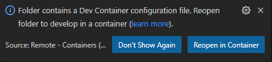

# Devcontainer CPU Based Demonstration User's Guide

## Table of Contents

- [Introduction](#introduction)
- [Using dev container](#using-dev-container)
- [How to install, deploy, test the Audio, Video, Analytics containers with avtool.sh](#how-to-install-deploy-test-the-audio-video-analytics-containers-with-avtoolsh)
- [Next Steps](#next-steps)

## Introduction

This document describe how to use the Video Analytics demonstration in this repository on your machine running Docker. 
It describes:

- how to install and use devcontainer with Visual Studio Code,
- how to build the containers used for the demonstration,
- how to deploy the containers used for the demonstration,
- how to start and stop the containers used for the demonstration,
- how to check the demonstration is fully functionning.

Below the workflow associated with the demonstration:


Below the architecture with the container running on Docker on the local machine:


Below a more advanced architecture with several camera and several AI Models:


## Using dev container

This repository contains a folder called ".devcontainer".  
When you'll open the project with Visual Studio Code, it will ask you to open the project in container mode provided some pre-requisites are installed on your machine.

### Installing pre-requisites

You need to install the following pre-requisite on your machine

1. Install and configure [Docker](https://www.docker.com/get-started) for your operating system.

   - Windows / macOS:

     1. Install [Docker Desktop](https://www.docker.com/products/docker-desktop) for Windows/Mac.

     2. Right-click on the Docker task bar item, select Settings / Preferences and update Resources > File Sharing with any locations your source code is kept. See [tips and tricks](https://code.visualstudio.com/docs/remote/troubleshooting#_container-tips) for troubleshooting.

     3. If you are using WSL 2 on Windows, to enable the [Windows WSL 2 back-end](https://docs.docker.com/docker-for-windows/wsl/): Right-click on the Docker taskbar item and select Settings. Check Use the WSL 2 based engine and verify your distribution is enabled under Resources > WSL Integration.

   - Linux:

     1. Follow the official install [instructions for Docker CE/EE for your distribution](https://docs.docker.com/get-docker/). If you are using Docker Compose, follow the [Docker Compose directions](https://docs.docker.com/compose/install/) as well.

     2. Add your user to the docker group by using a terminal to run: sudo usermod -aG docker $USER

     3. Sign out and back in again so your changes take effect.

2. Install [Visual Studio Code](https://code.visualstudio.com/).

3. Install the [Remote Development extension pack](https://marketplace.visualstudio.com/items?itemName=ms-vscode-remote.vscode-remote-extensionpack)

4. Install Git on your machine following the steps [here](https://git-scm.com/book/en/v2/Getting-Started-Installing-Git)   

### Using devcontainer

1. Clone the spikes repository on your machine

    ```bash
        mkdir $HOME/git
        cd $HOME/git
        git clone https://CSECodeHub@dev.azure.com/CSECodeHub/528239%20-%20NTT%20Airport%20Security%20Autonomous%20Fence%20Inspection%20using/_git/spikes 
    ```

2. Change to the project directory.  
For instance:  

    ```bash
        cd spikes
    ```

3. Launch Visual Studio Code in the folder where you stored the spikes repository

    ```bash
        c:\git\spikes> code .
    ```

4. Once Visual Studio Code is launched, you should see the following dialgo box:

    

5. Click on the button 'Reopen in Container'
6. Visual Studio Code will now open the devcontainer. If it's the first time you open the project in container mode, it will first build the container.
7. Once the container is loaded, you can open a new terminal (Terminal -> New Terminal).
8. You have access to the tools installed in the devcontainer like ffmpeg, az client,... You could use this devcontainer to stream video directly towards the virtual machines or containers  in Azure.  

    ```bash
        vscode@d0b2b4ea7293:/workspace$ ffmpeg 
    ```

## How to install, deploy, test the Audio, Video, Analytics containers with avtool.sh

To test the Audio/Video/Analytics containers, you can use a bash file called envs\container\devcontainer\avtool.sh which to:

- build the containers, ...
- deploy/undeploy the containers,...
- start/stop the containers
- get the status of the containers (running, exited, ...)

To use this bash file avtool.sh you need to use the devcontainer.

### Configuring avtool.sh

Before using avtool.sh, you need to configure some variables which will used by the avtool.sh.
When altool.sh is launched, it will read the configuration variables in the file config/.avtoolconfig.
In this chapter, we will configure the configuration variables for your demonstration.
Though the demonstration is running locally, you need an Internet connection and two Azure Services: 

1. Azure Storage to store:
    - the video chuncks on Azure Storage,
    - the frame analyzed and the result of the analysis.
    You need to create an Azure Storage associated with your Azure subscription. Once the Azure Storage is created, you need to create the following containers:
    - "record" which will contain the video chunks
    - "result" which will contain the result of the analysis
    At least, you need to create a Shared Access Signature (SAS) Token associated with this Azure Storage, the bash avtool.sh will use this SAS Token for the authentication with Azure Storage.

2. Azure Computer Vision to analyze the incoming videos.
    You need to create a Computer Vision Account on your Azure Subscription.
    Once the Computer Vision account is created check the endpoint and the key associated in the tab "Keys and Endpoint".  

Follow the steps below to configure the demonstration.

1. In Visual Studio Code, once the devcontainer is loaded, in the Terminal shell change to a directory containing the avtool.sh file.  

    ```bash
        cd envs/container/devcontainer 
    ```

2. This folder contains all the resources to deploy the demonstration locally on your machine. You can now run avtool.sh. 
For instance:  

    ```bash
        ./avtool.sh

        Arguments:
            -a  Sets AV Tool action {build, deploy, undeploy, start, stop, status}
            -c  Sets the AV Tool configuration file

        Example:
            bash ./avtool.sh -a build 
            bash ./avtool.sh -a deploy 
    ```

3. Open the file config/.avtoolconfig, and update the following variables:
        - AV_MODEL_CUSTOM_VISION_URL: with the Custom Vision endpoint
        - AV_MODEL_CUSTOM_VISION_KEY: with the Custom Vision key
        - AV_RECORDER_STORAGE_URL: with https://YOUR STORAGE_ACCOUNT.blob.core.windows.net/record
        - AV_RECORDER_STORAGE_SAS_TOKEN: with Azure Storage SAS Token
        - AV_RECORDER_STORAGE_FOLDER: with version "/version1.0"
        - AV_EDGE_STORAGE_URL: with https://YOUR STORAGE_ACCOUNT.blob.core.windows.net/record
        - AV_EDGE_STORAGE_SAS_TOKEN: with Azure Storage SAS Token
        - AV_EDGE_STORAGE_FOLDER: with version "/version1.0"

```bash
    AV_TEMPDIR=/tmp/test
    AV_FLAVOR=ubuntu
    AV_IMAGE_FOLDER=av-services

    AV_RTMP_RTSP_CONTAINER_NAME=rtmprtspsink-ubuntu-container
    AV_RTMP_RTSP_IMAGE_NAME=rtmprtspsink-ubuntu-image 
    AV_RTMP_RTSP_COMPANYNAME=contoso
    AV_RTMP_RTSP_HOSTNAME=localhost
    AV_RTMP_RTSP_PORT_HLS=8080
    AV_RTMP_RTSP_PORT_HTTP=80
    AV_RTMP_RTSP_PORT_SSL=443
    AV_RTMP_RTSP_PORT_RTMP=1935
    AV_RTMP_RTSP_PORT_RTSP=8554
    AV_RTMP_RTSP_STREAM_LIST=camera1:camera2

    AV_MODEL_YOLO_ONNX_PORT_HTTP=8081
    AV_MODEL_YOLO_ONNX_IMAGE_NAME=http-yolov3-onnx-image
    AV_MODEL_YOLO_ONNX_CONTAINER_NAME=http-yolov3-onnx-container

    AV_MODEL_COMPUTER_VISION_PORT_HTTP=8082
    AV_MODEL_COMPUTER_VISION_IMAGE_NAME=computer-vision-image
    AV_MODEL_COMPUTER_VISION_CONTAINER_NAME=computer-vision-container
    AV_MODEL_COMPUTER_VISION_URL="to_be_completed"
    AV_MODEL_COMPUTER_VISION_KEY="to_be_completed"

    AV_MODEL_CUSTOM_VISION_PORT_HTTP=8083
    AV_MODEL_CUSTOM_VISION_IMAGE_NAME=custom-vision-image
    AV_MODEL_CUSTOM_VISION_CONTAINER_NAME=custom-vision-container
    AV_MODEL_CUSTOM_VISION_URL="to_be_completed"
    AV_MODEL_CUSTOM_VISION_KEY="to_be_completed"

    AV_FFMPEG_IMAGE_NAME=ffmpeg-image
    AV_FFMPEG_CONTAINER_NAME=ffmpeg-container
    AV_FFMPEG_LOCAL_FILE=camera-300s.mkv
    AV_FFMPEG_VOLUME=/tempvol
    AV_FFMPEG_STREAM_LIST=camera1:camera2
    AV_FFMPEG_FILE_LIST=camera-300s.mkv:lots_015.mkv

    AV_RECORDER_IMAGE_NAME=recorder-image
    AV_RECORDER_CONTAINER_NAME=recorder-container
    AV_RECORDER_INPUT_URL=
    AV_RECORDER_PERIOD=2
    AV_RECORDER_STORAGE_URL=https://to_be_completed.blob.core.windows.net/to_be_completed
    AV_RECORDER_STORAGE_SAS_TOKEN=?to_be_completed
    AV_RECORDER_STORAGE_FOLDER=/to_be_completed
    AV_RECORDER_VOLUME=/tempvol
    AV_RECORDER_STREAM_LIST=camera1:camera2

    AV_EDGE_IMAGE_NAME=edge-image
    AV_EDGE_CONTAINER_NAME=edge-container
    AV_EDGE_INPUT_URL=
    AV_EDGE_PERIOD=2
    AV_EDGE_STORAGE_URL=https://to_be_completed.blob.core.windows.net/to_be_completed
    AV_EDGE_STORAGE_SAS_TOKEN=?to_be_completed
    AV_EDGE_STORAGE_FOLDER=/to_be_completed
    AV_EDGE_MODEL_URL=
    AV_EDGE_VOLUME=/tempvol
    AV_EDGE_STREAM_LIST=camera1:camera2

    AV_WEBAPP_IMAGE_NAME=webapp-image
    AV_WEBAPP_CONTAINER_NAME=webapp-container
    AV_WEBAPP_PORT_HTTP=8084
    AV_WEBAPP_STORAGE_RESULT_URL=https://to_be_completed.blob.core.windows.net/to_be_completed
    AV_WEBAPP_STORAGE_RESULT_SAS_TOKEN=?to_be_completed
    AV_WEBAPP_STORAGE_RECORD_URL=https://to_be_completed.blob.core.windows.net/to_be_completed
    AV_WEBAPP_STORAGE_RECORD_SAS_TOKEN=?to_be_completed
    AV_WEBAPP_FOLDER=version1.0
    AV_WEBAPP_STREAM_URL_PREFIX=
    AV_WEBAPP_STREAM_LIST=camera1:camera2

    AV_RTSP_SOURCE_IMAGE_NAME=rtsp-source-image
    AV_RTSP_SOURCE_CONTAINER_NAME=rtsp-source-container
    AV_RTSP_SOURCE_PORT=554
```

4. Once the avtool.sh is configured, you can build and deploy the containers.

### Building the containers

1. From the devcontainer terminal, run the following command to build the container

    ```bash
        ./avtool.sh -a build
    ```

### Deploying the containers

1. From the devcontainer terminal, run the following command to deploy the container

    ```bash
        ./avtool.sh -a deploy
    ```

2. Once the containers are deployed, you can check whether they are running using the following command:

    ```bash
        ./avtool.sh -a status
    ```

### Starting/Stopping containers

Once the containers are built, you can stop and start the containers.

1. Run the following command to stop the containers

    ```bash
        ./avtool.sh -a stop
    ```

2. You can run the following command to get the status of the containers

    ```bash
        ./avtool.sh -a status
    ```

3. If the containers are stopped, you can run the following command to start the containers  

    ```bash
        ./avtool.sh -a start
    ```

### Testing the containers

#### Testing the video streams

Once the containers are running, you can check whether the following services are running:
- the video ingestion,
- the video recording,
- the AI models

1. Open the url: http://localhost/player.html with your favorite brower. You should see the following page, click on the Play button to display the video.

    

2. Moreover, you can see on this page, the list of URLs to play the same video using a different streaming protocol like:
    - RTMP: rtmp://localhost:1935/live/stream - players: ffplay, VLC
    - RTSP: rtsp://localhost:8554/rtsp/stream - players: ffplay, VLC
    - HLS: http://localhost:8080/hls/stream.m3u8 - players: Browser, ffplay, VLC
    - DASH: http://localhost:8080/dash/stream.mpd - players: ffplay

3. You can also check whether the video recording is fully functionning. From the Azure Portal, navigate to the Storage account and to the container "record". You should see the video chunks on the sotrage account.

        

4. You can also check whether the AI model detected some objects. From the Azure Portal, navigate to the Storage account and to the container "result". You should see the frame (jpg file) and the analysis result (json file) on the sotrage account.

    

#### Testing with the Web Application

By default, the solution is deployed with a container running the Web App. This container called "webapp-container" hosts the Web Application which is used to check whether the video ingestion, the AI analysis and the recording are fully functionning.

##### Video Ingestion

On the Live page, you can play the the video feeds coming from the cameras:


##### Video Ingestion

On the Results page, you can visualize the results of the frame analysis by:
- Yolov3
- Azure Computer Vision
- Azure Custom Vision


##### Video Recording

On the Records page, you can visualize the live video recorded on the Azure Storage.


#### Testing the AI Models with curl

By default, the solution is deployed with 3 containers runing differnet Object Detections models:
- Yolov3
- Azure Computer Vision
- Azure Custom Vision

Using curl you can check whether the Object Detections services are fully functionning.

##### Testing Yolov3

Before testing Yolov3, you need to know the IP address and the TCP Port associated with Yolov3 container.
Run the following command from you devcontainer terminal.

``` 
    docker container inspect http-yolov3-onnx-container | jq -r '.[].NetworkSettings.Networks.bridge.IPAddress'
    docker container inspect http-yolov3-onnx-container | jq -r '.[].NetworkSettings.Ports'
``` 

Once you know the IP address and the TCP port, you can test the service using the following curl command using an image from the content folder in the repository.

The json string response from Yolo will start with '{"inferences":'

``` 
    curl -i -X POST http://172.17.0.4:8081/score -H 'Expect:' -H "Content-Type: image/jpeg" --data-binary @"./content/frame.jpg"

    {"inferences": [{"type": "entity", "entity": {"tag": {"value": "car", "confidence": 0.9402651190757751}, "box": {"l": 0.3611767842219426, "t": 0.5632959512563852, "w": 0.03565769929152269, "h": 0.013576764326829176}}}, {"type": "entity", "entity": {"tag": {"value": "car", "confidence": 0.8375570774078369}, "box": {"l": 0.7878504533034104, "t": 0.49765260402972883, "w": 0.031458487877478965, "h": 0.012661090263953576}}}, {"type": "entity", "entity": {"tag": {"value": "car", "confidence": 0.6296254992485046}, "box": {"l": 0.7492078634408804, "t": 0.5148971264178936, "w": 0.02511141850398137, "h": 0.012255411881666917}}}]}

``` 


##### Testing Computer Vision

Before testing Computer Vision, you need to know the IP address and the TCP Port associated with Computer Vision proxy container.
Run the following command from you devcontainer terminal.

``` 
    docker container inspect computer-vision-container | jq -r '.[].NetworkSettings.Networks.bridge.IPAddress'
    docker container inspect computer-vision-container | jq -r '.[].NetworkSettings.Ports'
``` 

Once you know the IP address and the TCP port, you can test the service using the following curl command using an image from the content folder in the repository.

The json string response from Yolo will start with '{"categories":'

``` 
    curl -i -X POST http://172.17.0.5:8082/score -H 'Expect:' -H "Content-Type: image/jpeg" --data-binary @"./content/frame.jpg"

    {"categories":[{"name":"outdoor_","score":0.03515625,"detail":{"landmarks":[]}},{"name":"outdoor_waterside","score":0.73046875,"detail":{"landmarks":[]}}],"objects":[],"requestId":"5616ea4a-3c38-4fd0-a351-e5fdcaa92d5e","metadata":{"height":720,"width":1280,"format":"Jpeg"},"modelVersion":"2021-05-01"}

``` 

You can also from your devcontainer terminal test directly the Computer Vision Service provided you know the following parameters:

- CUSTOM_VISION_PREDICTION_SERVICE_NAME: you can get this information from the Azure Portal
- CUSTOM_VISION_PREDICTION_PROJECT_ID: you can get this information from the "prediction URL" on the custom vision portal (https://www.customvision.ai/)
- CUSTOM_VISION_PREDICTION_ITERATION_NAME: you can get this information from the "prediction URL" on the custom vision portal (https://www.customvision.ai/)
- CUSTOM_VISION_PREDICTION_KEY: you can get this information from the "prediction URL" on the custom vision portal (https://www.customvision.ai/)

Running the following command:

``` 
    curl -i -X POST  --data-binary "@./content/frame.jpg" "https://{COMPUTER_VISION_SERVICE_NAME}.cognitiveservices.azure.com/vision/v3.2/analyze?visualFeatures=Objects&details=Landmarks&language=en&model-version=latest" -H "Content-Type: application/octet-stream" -H "Ocp-Apim-Subscription-Key: {COMPUTER_VISION_KEY}"

    {"categories":[{"name":"outdoor_","score":0.03515625,"detail":{"landmarks":[]}},{"name":"outdoor_waterside","score":0.73046875,"detail":{"landmarks":[]}}],"objects":[],"requestId":"42808dcd-65ac-4b24-aceb-3d9da38e9bdb","metadata":{"height":720,"width":1280,"format":"Jpeg"},"modelVersion":"2021-05-01"}

``` 

##### Testing Custom Vision

Before testing Custom Vision, you need to know the IP address and the TCP Port associated with Custom Vision proxy container.
Run the following command from you devcontainer terminal.

``` 
    docker container inspect custom-vision-container | jq -r '.[].NetworkSettings.Networks.bridge.IPAddress'
    docker container inspect custom-vision-container | jq -r '.[].NetworkSettings.Ports'
``` 

Once you know the IP address and the TCP port, you can test the service using the following curl command using an image from the content folder in the repository.

The json string response from Yolo will start with '{"categories":'

``` 
    curl -i -X POST http://172.17.0.6:8083/score -H 'Expect:' -H "Content-Type: image/jpeg" --data-binary @"./content/frame.jpg"

    {"id":"ce06abe7-8813-419c-8d1b-8856ae7f2702","project":"5d2fb5c1-8273-49b0-8dee-c39b40a6f876","iteration":"193cd765-a89c-43a9-9e45-b7705f0841c8","created":"2022-10-05T14:19:10.810Z","predictions":[{"probability":0.061713934,"tagId":"08e08234-cda3-42dd-b036-d22d5853f773","tagName":"ladder","boundingBox":{"left":0.13520098,"top":0.027334869,"width":0.74326086,"height":0.9151208}},{"probability":0.0121720135,"tagId":"08e08234-cda3-42dd-b036-d22d5853f773","tagName":"ladder","boundingBox":{"left":0.2800629,"top":-0.09190044,"width":0.46480322,"height":0.8521081}}]}

``` 

You can also from your devcontainer terminal test directly the Custom Vision Service provided you know the following parameters:

- CUSTOM_VISION_PREDICTION_SERVICE_NAME: you can get this information from the Azure Portal
- CUSTOM_VISION_PREDICTION_PROJECT_ID: you can get this information from the "prediction URL" on the custom vision portal (https://www.customvision.ai/)
- CUSTOM_VISION_PREDICTION_ITERATION_NAME: you can get this information from the "prediction URL" on the custom vision portal (https://www.customvision.ai/)
- CUSTOM_VISION_PREDICTION_KEY: you can get this information from the "prediction URL" on the custom vision portal (https://www.customvision.ai/)

Running the following command:

``` 
    curl -i -X POST  --data-binary "@./content/frame.jpg" https://{CUSTOM_VISION_PREDICTION_SERVICE_NAME}.cognitiveservices.azure.com/customvision/v3.0/Prediction/{CUSTOM_VISION_PREDICTION_PROJECT_ID}/detect/iterations/{CUSTOM_VISION_PREDICTION_ITERATION_NAME}/image -H "Content-Type: application/octet-stream" -H "Prediction-Key: {CUSTOM_VISION_PREDICTION_KEY}"

    {"id":"cb3b13c5-5eb6-4400-966d-303aae8849b5","project":"5d2fb5c1-8273-49b0-8dee-c39b40a6f876","iteration":"193cd765-a89c-43a9-9e45-b7705f0841c8","created":"2022-10-05T14:20:46.897Z","predictions":[{"probability":0.061713934,"tagId":"08e08234-cda3-42dd-b036-d22d5853f773","tagName":"ladder","boundingBox":{"left":0.13520098,"top":0.027334869,"width":0.74326086,"height":0.9151208}},{"probability":0.0121720135,"tagId":"08e08234-cda3-42dd-b036-d22d5853f773","tagName":"ladder","boundingBox":{"left":0.2800629,"top":-0.09190044,"width":0.46480322,"height":0.8521081}}]}

``` 

##### Build the Extractframe binary

The application/tool extract frame is built in the container extractframe.
Once this container is created you can copy the binary and libraries on your host machine.

```bash
    # install libraries
    sudo apt-get update -y 
    sudo apt-get install -y --no-install-recommends libva-drm2 libva2 i965-va-driver

    # build extractframe in container
    docker build   -f ./envs/container/docker/extractframe/ubuntu/Dockerfile ./envs/container/docker/extractframe/ubuntu/. -t av-services/extractframe-image:latest
    
    # Create directory on the host machine to receive the binaries 
    mkdir /tmp/extractframe
    cd /tmp/extractframe
    # Copy binaries to the host machine
    docker create --name dummy av-services/extractframe-image:latest
    docker cp dummy:/usr/local/bin/extractframe .
    docker cp dummy:/usr/local/lib/libavformat.so.59 .
    docker cp dummy:/usr/local/lib/libavformat.so.59.27.100 .
    docker cp dummy:/usr/local/lib/libavcodec.so.59 . 
    docker cp dummy:/usr/local/lib/libavcodec.so.59.37.100 .
    docker cp dummy:/usr/local/lib/libavutil.so.57 . 
    docker cp dummy:/usr/local/lib/libavutil.so.57.28.100 .
    docker cp dummy:/usr/local/lib/libswscale.so.6 .
    docker cp dummy:/usr/local/lib/libswscale.so.6.7.100 .
    docker cp dummy:/usr/local/lib/libswresample.so.4 .
    docker cp dummy:/usr/local/lib/libswresample.so.4.7.100 .
    docker rm -f dummy
    # Run extractframe
    LD_LIBRARY_PATH=. ./extractframe

```


# Next Steps

Below a list of possible improvements:  

1. Record playable video chunks on Azure Storage using DASH procotol
2. Use more efficient Object Detection Models
3. Improve the pipeline performance (don't store frame nor result file on local disk, reference each chunk, frame and result file with a timestamp).
4. Add a Web UI to display the result of the Analysis.
5. A GPU based demonstration to improve the performances.
