# Azure Virtual Machine Based Demonstration User's Guide

## Table of Contents

- [Introduction](#introduction)
- [Using dev container](#using-dev-container)
- [How to install, deploy, test the Virtual Machine, Audio, Video, Analytics containers with evatool.sh](#how-to-install-deploy-test-the-audio-video-analytics-containers-with-avtoolsh)
- [Next Steps](#next-steps)

## Introduction

This document describe how to use the Video Analytics demonstration in this repository on your machine running Docker. 
It describes:

- how to install and use devcontainer with Visual Studio Code,
- how to deploy the virtual machine running docker,
- how to build the containers used for the demonstration,
- how to deploy the containers used for the demonstration,
- how to start and stop the containers used for the demonstration,
- how to check the demonstration is fully functionning.

Below the workflow associated with the demonstration:

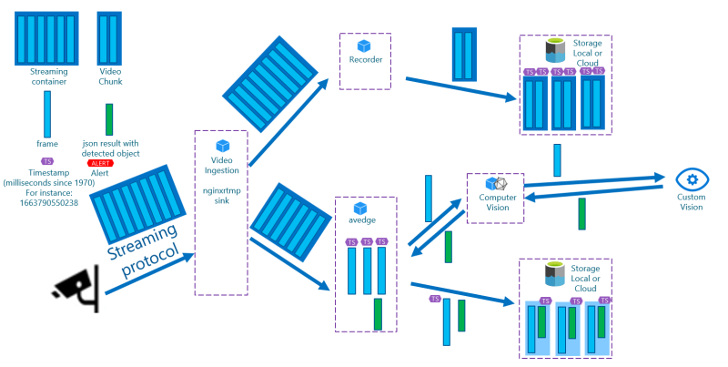

Below the architecture with the container running on Docker on the local machine:

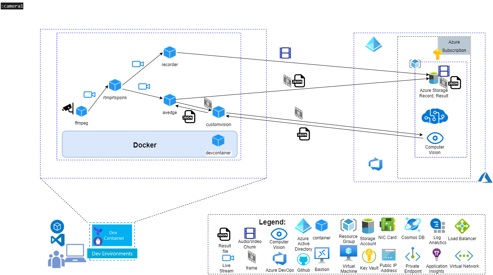

Below a more advanced architecture with several camera and several AI Models:

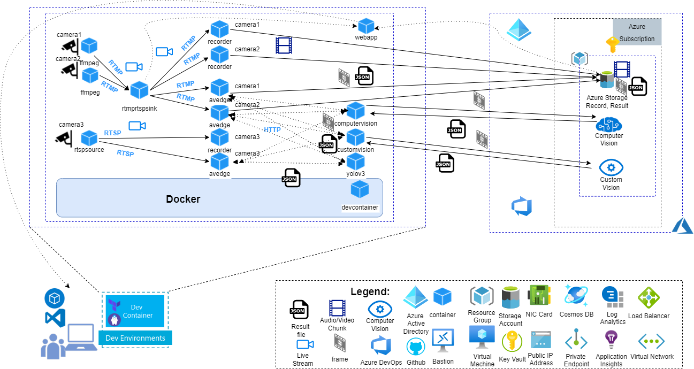

## Using dev container

This repository contains a folder called ".devcontainer".  
When you'll open the project with Visual Studio Code, it will ask you to open the project in container mode provided some pre-requisites are installed on your machine.

### Installing pre-requisites

You need to install the following pre-requisite on your machine

1. Install and configure [Docker](https://www.docker.com/get-started) for your operating system.

   - Windows / macOS:

     1. Install [Docker Desktop](https://www.docker.com/products/docker-desktop) for Windows/Mac.

     2. Right-click on the Docker task bar item, select Settings / Preferences and update Resources > File Sharing with any locations your source code is kept. See [tips and tricks](https://code.visualstudio.com/docs/remote/troubleshooting#_container-tips) for troubleshooting.

     3. If you are using WSL 2 on Windows, to enable the [Windows WSL 2 back-end](https://docs.docker.com/docker-for-windows/wsl/): Right-click on the Docker taskbar item and select Settings. Check Use the WSL 2 based engine and verify your distribution is enabled under Resources > WSL Integration.

   - Linux:

     1. Follow the official install [instructions for Docker CE/EE for your distribution](https://docs.docker.com/get-docker/). If you are using Docker Compose, follow the [Docker Compose directions](https://docs.docker.com/compose/install/) as well.

     2. Add your user to the docker group by using a terminal to run: sudo usermod -aG docker $USER

     3. Sign out and back in again so your changes take effect.

2. Install [Visual Studio Code](https://code.visualstudio.com/).

3. Install the [Remote Development extension pack](https://marketplace.visualstudio.com/items?itemName=ms-vscode-remote.vscode-remote-extensionpack)

4. Install Git on your machine following the steps [here](https://git-scm.com/book/en/v2/Getting-Started-Installing-Git)   

### Using devcontainer

1. Clone the spikes repository on your machine

    ```bash
        mkdir $HOME/git
        cd $HOME/git
        git clone https://CSECodeHub@dev.azure.com/CSECodeHub/528239%20-%20NTT%20Airport%20Security%20Autonomous%20Fence%20Inspection%20using/_git/spikes 
    ```

2. Change to the project directory.  
For instance:  

    ```bash
        cd spikes
    ```

3. Launch Visual Studio Code in the folder where you stored the spikes repository

    ```bash
        c:\git\spikes> code .
    ```

4. Once Visual Studio Code is launched, you should see the following dialgo box:

    

5. Click on the button 'Reopen in Container'
6. Visual Studio Code will now open the devcontainer. If it's the first time you open the project in container mode, it will first build the container.
7. Once the container is loaded, you can open a new terminal (Terminal -> New Terminal).
8. You have access to the tools installed in the devcontainer like ffmpeg, az client,... You could use this devcontainer to stream video directly towards the virtual machines or containers  in Azure.  

    ```bash
        vscode@d0b2b4ea7293:/workspace$ ffmpeg 
    ```

## How to install, deploy, test the Audio, Video, Analytics containers with evatool.sh

To test the Audio/Video/Analytics containers, you can use a bash file called envs\container\devcontainer\evatool.sh which to:

- build the containers, ...
- deploy/undeploy the containers,...
- start/stop the containers
- get the status of the containers (running, exited, ...)

To use this bash file evatool.sh you need to use the devcontainer.

### Deploying Demonstrations

Currently the repository contains two possible demonstrations:
- a demonstration running locally on your machine using the local docker service and Azure Storage, Azure Computer Vision.
- a demonstration running in a virtual machine in Azure using the docker service in the virtual machine, Azure Container registry, Azure Storage, Azure Computer Vision.
 
#### Local Demonstration

##### Configuring evatool.sh

Before using evatool.sh, you need to configure some variables which will used by the evatool.sh.
When evatool.sh is launched, it will read the configuration variables in the file config/.avtoolconfig.
In this chapter, we will configure the configuration variables for your demonstration.
Though the demonstration is running locally, you need an Internet connection and two Azure Services: 

1. Azure Storage to store:
    - the video chuncks on Azure Storage,
    - the frame analyzed and the result of the analysis.
    You need to create an Azure Storage associated with your Azure subscription. Once the Azure Storage is created, you need to create the following containers:
    - "record" which will contain the video chunks
    - "result" which will contain the result of the analysis
    At least, you need to create a Shared Access Signature (SAS) Token associated with this Azure Storage, the bash evatool.sh will use this SAS Token for the authentication with Azure Storage.

2. Azure Computer Vision to analyze the incoming videos (optional: by default the system will use the local Yolov3 container).
    You need to create a Computer Vision Account on your Azure Subscription.
    Once the Computer Vision account is created check the endpoint and the key associated in the tab "Keys and Endpoint".  

3. Azure Custom Vision to analyze the incoming videos (optional: by default the system will use the local Yolov3 container).
    You need to create a Custom Vision Training Account and a Custom Vision Prediction Account  on your Azure Subscription.
    Once the Custom Vision account are created check the endpoint and the key associated in the tab "Keys and Endpoint". 

4. Azure Container Registry which could be used to store the container images (optional: by default the system will store the images on the local docker). 


Follow the steps below to configure the demonstration.

1. In Visual Studio Code, once the devcontainer is loaded, in the Terminal shell change to a directory containing the evatool.sh file.  

    ```bash
        cd envs/container/azurevm 
    ```

2. This folder contains all the resources to deploy the demonstration locally on your machine. You can now run evatool.sh. 
For instance:  

    ```bash
        ./evatool.sh

        Arguments:
            -a  Sets AV Tool action {build, create, remove, start, stop, status}
            -c  Sets the AV Tool configuration file

        Example:
            bash ./evatool.sh -a build 
            bash ./evatool.sh -a create 
    ```

3. Open the file config/.avtoolconfig, and update the following variables:
        - AV_MODEL_CUSTOM_VISION_URL: with the Custom Vision endpoint
        - AV_MODEL_CUSTOM_VISION_KEY: with the Custom Vision key
        - AV_RECORDER_STORAGE_URL: with https://YOUR STORAGE_ACCOUNT.blob.core.windows.net/record
        - AV_RECORDER_STORAGE_SAS_TOKEN: with Azure Storage SAS Token
        - AV_RECORDER_STORAGE_FOLDER: with version "/version1.0"
        - AV_EDGE_STORAGE_URL: with https://YOUR STORAGE_ACCOUNT.blob.core.windows.net/record
        - AV_EDGE_STORAGE_SAS_TOKEN: with Azure Storage SAS Token
        - AV_EDGE_STORAGE_FOLDER: with version "/version1.0"

```bash
        AV_TEMPDIR=/tmp/test
        AV_FLAVOR=ubuntu
        AV_IMAGE_FOLDER=av-services

        AV_RTMP_RTSP_CONTAINER_NAME=rtmprtspsink-ubuntu-container
        AV_RTMP_RTSP_IMAGE_NAME=rtmprtspsink-ubuntu-image 
        AV_RTMP_RTSP_COMPANYNAME=contoso
        AV_RTMP_RTSP_HOSTNAME=localhost
        AV_RTMP_RTSP_PORT_HLS=8080
        AV_RTMP_RTSP_PORT_HTTP=80
        AV_RTMP_RTSP_PORT_SSL=443
        AV_RTMP_RTSP_PORT_RTMP=1935
        AV_RTMP_RTSP_PORT_RTSP=8554
        AV_RTMP_RTSP_STREAM_LIST=camera1:camera2

        AV_MODEL_YOLO_ONNX_PORT_HTTP=8081
        AV_MODEL_YOLO_ONNX_IMAGE_NAME=http-yolov3-onnx-image
        AV_MODEL_YOLO_ONNX_CONTAINER_NAME=http-yolov3-onnx-container

        AV_MODEL_COMPUTER_VISION_PORT_HTTP=8082
        AV_MODEL_COMPUTER_VISION_IMAGE_NAME=computer-vision-image
        AV_MODEL_COMPUTER_VISION_CONTAINER_NAME=computer-vision-container
        AV_MODEL_COMPUTER_VISION_URL=
        AV_MODEL_COMPUTER_VISION_KEY=

        AV_MODEL_CUSTOM_VISION_PORT_HTTP=8083
        AV_MODEL_CUSTOM_VISION_IMAGE_NAME=custom-vision-image
        AV_MODEL_CUSTOM_VISION_CONTAINER_NAME=custom-vision-container
        AV_MODEL_CUSTOM_VISION_URL=
        AV_MODEL_CUSTOM_VISION_KEY=

        AV_FFMPEG_IMAGE_NAME=ffmpeg-image
        AV_FFMPEG_CONTAINER_NAME=ffmpeg-container
        AV_FFMPEG_LOCAL_FILE=camera-300s.mkv
        AV_FFMPEG_VOLUME=/tempvol
        AV_FFMPEG_STREAM_LIST=camera1:camera2
        AV_FFMPEG_FILE_LIST=camera-300s.mkv:lots_015.mkv

        AV_RECORDER_IMAGE_NAME=recorder-image
        AV_RECORDER_CONTAINER_NAME=recorder-container
        AV_RECORDER_INPUT_URL=
        AV_RECORDER_PERIOD=2
        AV_RECORDER_STORAGE_URL=https://to_be_completed.blob.core.windows.net/to_be_completed
        AV_RECORDER_STORAGE_SAS_TOKEN=?to_be_completed
        AV_RECORDER_STORAGE_FOLDER=/version1.0
        AV_RECORDER_VOLUME=/tempvol
        AV_RECORDER_STREAM_LIST=camera1:camera2

        AV_EDGE_IMAGE_NAME=edge-image
        AV_EDGE_CONTAINER_NAME=edge-container
        AV_EDGE_INPUT_URL=
        AV_EDGE_PERIOD=2
        AV_EDGE_STORAGE_URL=https://to_be_completed.blob.core.windows.net/to_be_completed
        AV_EDGE_STORAGE_SAS_TOKEN=?to_be_completed
        AV_EDGE_STORAGE_FOLDER=/version1.0
        AV_EDGE_MODEL_URL=
        AV_EDGE_VOLUME=/tempvol
        AV_EDGE_STREAM_LIST=camera1:camera2

        AV_WEBAPP_IMAGE_NAME=webapp-image
        AV_WEBAPP_CONTAINER_NAME=webapp-container
        AV_WEBAPP_PORT_HTTP=8084
        AV_WEBAPP_STORAGE_RESULT_URL=https://to_be_completed.blob.core.windows.net/to_be_completed
        AV_WEBAPP_STORAGE_RESULT_SAS_TOKEN=to_be_completed
        AV_WEBAPP_STORAGE_RECORD_URL=https://to_be_completed.blob.core.windows.net/to_be_completed
        AV_WEBAPP_STORAGE_RECORD_SAS_TOKEN=to_be_completed
        AV_WEBAPP_FOLDER=version1.0
        AV_WEBAPP_STREAM_LIST=camera1:camera2
        AV_WEBAPP_STREAM_URL_PREFIX=

        AV_RTSP_SOURCE_IMAGE_NAME=rtsp-source-image
        AV_RTSP_SOURCE_CONTAINER_NAME=rtsp-source-container
        AV_RTSP_SOURCE_PORT=554

```
4. To avoid any configuration conflict with the Virtual Machine configuration, check that the variable AZURE_CONTAINER_REGISTRY is empty, AZURE_VIRTUAL_MACHINE_HOSTNAME=localhost and 
AV_RTMP_RTSP_HOSTNAME=localhost.

```bash
        AZURE_CONTAINER_REGISTRY=
        .
        .
        AZURE_VIRTUAL_MACHINE_HOSTNAME=localhost
        .
        .
        AV_RTMP_RTSP_HOSTNAME=localhost

```
6. At least, as the Web App container will read blob storage on the Azure Storage Account, you need to add a CORS rule for your Web App.
Add the Allowed origins: "http://localhost:8084", select all the allowed methods, all the allowed headers, the exposed headers and set ùmax-age to 3600. 

    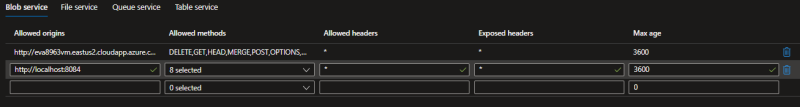

6. Once the evatool.sh is configured, you can build and deploy the containers.

##### Building the containers

1. From the devcontainer terminal, run the following command to build the container

    ```bash
        ./evatool.sh -a build
    ```

##### Deploying the containers

1. From the devcontainer terminal, run the following command to create and run the containers

    ```bash
        ./evatool.sh -a create
    ```

2. Once the containers are deployed, you can check whether they are running using the following command:

    ```bash
        ./evatool.sh -a status
    ```

##### Starting/Stopping containers

Once the containers are built, you can stop and start the containers.

1. Run the following command to stop the containers

    ```bash
        ./evatool.sh -a stop
    ```

2. You can run the following command to get the status of the containers

    ```bash
        ./evatool.sh -a status
    ```

3. If the containers are stopped, you can run the following command to start the containers  

    ```bash
        ./evatool.sh -a start
    ```

 
#### Virtual Machine Demonstration

##### Configuring evatool.sh

Before using evatool.sh, you need to configure some variables which will used by the evatool.sh.
When evatool.sh is launched, it will read the configuration variables in the file config/.avtoolconfig.
In this chapter, we will configure the configuration variables for your demonstration.
Though the demonstration is running locally, you need an Internet connection and two Azure Services: 

1. Azure Storage to store:
    - the video chuncks on Azure Storage,
    - the frame analyzed and the result of the analysis.
    You need to create an Azure Storage associated with your Azure subscription. Once the Azure Storage is created, you need to create the following containers:
    - "record" which will contain the video chunks
    - "result" which will contain the result of the analysis
    At least, you need to create a Shared Access Signature (SAS) Token associated with this Azure Storage, the bash evatool.sh will use this SAS Token for the authentication with Azure Storage.

2. Azure Computer Vision to analyze the incoming videos (optional: by default the system will use the local Yolov3 container).
    You need to create a Computer Vision Account on your Azure Subscription.
    Once the Computer Vision account is created check the endpoint and the key associated in the tab "Keys and Endpoint".  

3. Azure Custom Vision to analyze the incoming videos (optional: by default the system will use the local Yolov3 container).
    You need to create a Custom Vision Training Account and a Custom Vision Prediction Account  on your Azure Subscription.
    Once the Custom Vision account are created check the endpoint and the key associated in the tab "Keys and Endpoint". 

4. Azure Container Registry which could be used to store the container images (optional: by default the system will store the images on the local docker). 


Follow the steps below to configure the demonstration.

1. In Visual Studio Code, once the devcontainer is loaded, in the Terminal shell change to a directory containing the evatool.sh file.  

    ```bash
        cd envs/container/azurevm 
    ```

2. This folder contains all the resources to deploy the demonstration locally on your machine. You can now run evatool.sh. 
For instance:  

    ```bash
        ./evatool.sh

        Arguments:
            -a  Sets AV Tool action {install, login, build, create, remove, start, stop, status, vminstall, vmdeploy, vmundeploy, vmcreate, vmremove, vmstart, vmstop, vmstatus}
            -c  Sets the AV Tool configuration file

        Example:
            bash ./evatool.sh -a build 
            bash ./evatool.sh -a create 
    ```

3. Before launching the deployment of a new infrastructure in Azure, you need to be connected to Azure. Run the following command to establish a connection with Azure.

    ```bash
        ./evatool.sh -a login

    ```

4. Once you are connected and before launching the deployment of a new infrastructure, remove the file config/.avtoolconfig and the files config/outeva????key, config/outeva????key.pub. The file outeva???key.??? are used to store the SSH key for the authentication with the virtual machine. When launched for the first time, evatool.sh will create a new file config/.avtoolconfig. 4 random digits will be used to name all the Azure resources, the default prefix will be eva????. You can update this prefix, if you change the variable AZURE_PREFIX in config/.avtoolconfig. 

```bash
        AZURE_PREFIX=eva9966
        AZURE_REGION=eastus2
        AZURE_COMPUTER_VISION_SKU=S1
        AZURE_CUSTOM_VISION_SKU=S0
        AZURE_AUTHENTICATION_TYPE=sshPublicKey
        AZURE_LOCAL_IP_ADDRESS=176.177.31.9
        AZURE_LOGIN=evaadmin
        AZURE_AUTHENTICATION_TYPE=sshPublicKey
        AZURE_VM_SIZE=Standard_F4s_v2
        AZURE_PORT_HTTP=80 
        AZURE_PORT_WEBAPP_HTTP=8084 
        AZURE_PORT_SSL=443 
        AZURE_PORT_HLS=8080 
        AZURE_PORT_RTMP=1935
        AZURE_PORT_RTSP=8554

        AZURE_RESOURCE_GROUP=
        AZURE_STORAGE_ACCOUNT=
        AZURE_CONTENT_STORAGE_CONTAINER=
        AZURE_RECORD_STORAGE_CONTAINER=
        AZURE_RESULT_STORAGE_CONTAINER=
        AZURE_COMPUTER_VISION=
        AZURE_COMPUTER_VISION_KEY=
        AZURE_COMPUTER_VISION_ENDPOINT=
        AZURE_CUSTOM_VISION_TRAINING=
        AZURE_CUSTOM_VISION_TRAINING_KEY=
        AZURE_CUSTOM_VISION_TRAINING_ENDPOINT=
        AZURE_CUSTOM_VISION_PREDICTION=
        AZURE_CUSTOM_VISION_PREDICTION_KEY=
        AZURE_CUSTOM_VISION_PREDICTION_ENDPOINT=
        AZURE_CONTAINER_REGISTRY=
        AZURE_ACR_LOGIN_SERVER=
        AZURE_VIRTUAL_MACHINE_NAME=
        AZURE_VIRTUAL_MACHINE_HOSTNAME=
        AZURE_CONTENT_STORAGE_CONTAINER_URL=
        AZURE_CONTENT_STORAGE_CONTAINER_SAS_TOKEN=
        AZURE_RECORD_STORAGE_CONTAINER_URL=
        AZURE_RECORD_STORAGE_CONTAINER_SAS_TOKEN=
        AZURE_RESULT_STORAGE_CONTAINER_URL=
        AZURE_RESULT_STORAGE_CONTAINER_SAS_TOKEN=


        AV_TEMPDIR=/tmp/test
        AV_FLAVOR=ubuntu
        AV_IMAGE_FOLDER=av-services

        AV_RTMP_RTSP_CONTAINER_NAME=rtmprtspsink-ubuntu-container
        AV_RTMP_RTSP_IMAGE_NAME=rtmprtspsink-ubuntu-image 
        AV_RTMP_RTSP_COMPANYNAME=contoso
        AV_RTMP_RTSP_HOSTNAME=localhost
        AV_RTMP_RTSP_PORT_HLS=8080
        AV_RTMP_RTSP_PORT_HTTP=80
        AV_RTMP_RTSP_PORT_SSL=443
        AV_RTMP_RTSP_PORT_RTMP=1935
        AV_RTMP_RTSP_PORT_RTSP=8554
        AV_RTMP_RTSP_STREAM_LIST=camera1,camera2

        AV_MODEL_YOLO_ONNX_PORT_HTTP=8081
        AV_MODEL_YOLO_ONNX_IMAGE_NAME=http-yolov3-onnx-image
        AV_MODEL_YOLO_ONNX_CONTAINER_NAME=http-yolov3-onnx-container

        AV_MODEL_COMPUTER_VISION_PORT_HTTP=8082
        AV_MODEL_COMPUTER_VISION_IMAGE_NAME=computer-vision-image
        AV_MODEL_COMPUTER_VISION_CONTAINER_NAME=computer-vision-container
        AV_MODEL_COMPUTER_VISION_URL=
        AV_MODEL_COMPUTER_VISION_KEY=

        AV_MODEL_CUSTOM_VISION_PORT_HTTP=8083
        AV_MODEL_CUSTOM_VISION_IMAGE_NAME=custom-vision-image
        AV_MODEL_CUSTOM_VISION_CONTAINER_NAME=custom-vision-container
        AV_MODEL_CUSTOM_VISION_URL=
        AV_MODEL_CUSTOM_VISION_KEY=

        AV_FFMPEG_IMAGE_NAME=ffmpeg-image
        AV_FFMPEG_CONTAINER_NAME=ffmpeg-container
        AV_FFMPEG_LOCAL_FILE=camera-300s.mkv
        AV_FFMPEG_VOLUME=/tempvol
        AV_FFMPEG_STREAM_LIST=camera1,camera2
        AV_FFMPEG_INPUT_LIST=rtsp://lots_015.mkv,rtsp://fence.mp4

        AV_RECORDER_IMAGE_NAME=recorder-image
        AV_RECORDER_CONTAINER_NAME=recorder-container
        AV_RECORDER_INPUT_URL=
        AV_RECORDER_PERIOD=2
        AV_RECORDER_STORAGE_URL=https://to_be_completed.blob.core.windows.net/to_be_completed
        AV_RECORDER_STORAGE_SAS_TOKEN=?to_be_completed
        AV_RECORDER_STORAGE_FOLDER=/version1.0
        AV_RECORDER_VOLUME=/tempvol
        AV_RECORDER_STREAM_LIST=camera1,camera2

        AV_EDGE_IMAGE_NAME=edge-image
        AV_EDGE_CONTAINER_NAME=edge-container
        AV_EDGE_INPUT_URL=
        AV_EDGE_PERIOD=2
        AV_EDGE_STORAGE_URL=https://to_be_completed.blob.core.windows.net/to_be_completed
        AV_EDGE_STORAGE_SAS_TOKEN=?to_be_completed
        AV_EDGE_STORAGE_FOLDER=/version1.0
        AV_EDGE_MODEL_URL=
        AV_EDGE_VOLUME=/tempvol
        AV_EDGE_STREAM_LIST=camera1,camera2

        AV_WEBAPP_IMAGE_NAME=webapp-image
        AV_WEBAPP_CONTAINER_NAME=webapp-container
        AV_WEBAPP_PORT_HTTP=8084
        AV_WEBAPP_STORAGE_RESULT_URL=https://to_be_completed.blob.core.windows.net/to_be_completed
        AV_WEBAPP_STORAGE_RESULT_SAS_TOKEN=to_be_completed
        AV_WEBAPP_STORAGE_RECORD_URL=https://to_be_completed.blob.core.windows.net/to_be_completed
        AV_WEBAPP_STORAGE_RECORD_SAS_TOKEN=to_be_completed
        AV_WEBAPP_FOLDER=version1.0
        AV_WEBAPP_STREAM_LIST=camera1,camera2
        AV_WEBAPP_STREAM_URL_PREFIX=

        AV_RTSP_SOURCE_IMAGE_NAME=rtsp-source-image
        AV_RTSP_SOURCE_CONTAINER_NAME=rtsp-source-container
        AV_RTSP_SOURCE_PORT=554

        AV_RTSP_SERVER_IMAGE_NAME=rtsp-server-image
        AV_RTSP_SERVER_CONTAINER_NAME=rtsp-server-container
        AV_RTSP_SERVER_PORT_RTSP=554
        AV_RTSP_SERVER_FILE_LIST=lots_015.mkv,fence.mp4


```

5. Once the evatool.sh is configured, you can deploy the virtual machines, build and deploy the containers.

##### Deploying the virtual machine, Azure Container Registry, Azure Storage Account, Computer Vision and Custom Vision services

1. From the devcontainer terminal, run the following command to build the container

    ```bash
        ./evatool.sh -a vmdeploy
    ```
2. Once the resources are deployed, you can check the list of new services with the Azure Portal.

    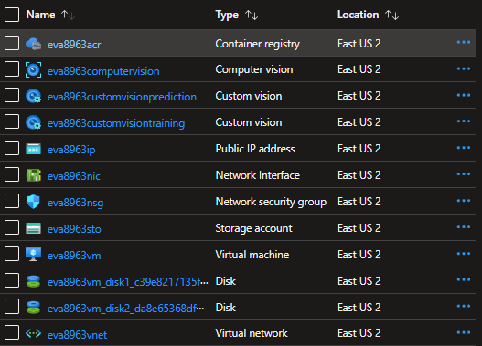

##### Building the containers

1. From the devcontainer terminal, run the following command to build the container

    ```bash
        ./evatool.sh -a vmbuild
    ```

##### Deploying the containers

1. From the devcontainer terminal, run the following command to create and run the containers

    ```bash
        ./evatool.sh -a vmcreate
    ```

2. Once the containers are deployed, you can check whether they are running using the following command:

    ```bash
        ./evatool.sh -a vmstatus
    ```
3. You can also check the status of the containers being connected to the virtual machine through a SSH connections. 

    ```bash
        ssh -i ./config/outeva<4digits>key evaadmin@<VirtualMachineIPAddress>
    ```
4. Once connected, you can run the following command to list the containers running.

    ```bash
        docker ps

        CONTAINER ID   IMAGE                                                                COMMAND                  CREATED              STATUS              PORTS                                                                                                                                                                                                       NAMES
        e0376ac38bf6   eva8963acr.azurecr.io/av-services/rtsp-source-image:latest           "./live555MediaServer"   About a minute ago   Up About a minute   0.0.0.0:554->554/tcp, :::554->554/tcp                                                                                                                                                                       rtsp-source-container
        6f5ac149d0e5   eva8963acr.azurecr.io/av-services/webapp-image:latest                "/bin/sh -c /docker-…"   About a minute ago   Up About a minute   0.0.0.0:8084->8084/tcp, :::8084->8084/tcp                                                                                                                                                                   webapp-container
        d923a7562c6d   eva8963acr.azurecr.io/av-services/edge-image:latest                  "/bin/sh -c /docker-…"   About a minute ago   Up About a minute                                                                                                                                                                                                               edge-container-camera2
        7eeaba22791b   eva8963acr.azurecr.io/av-services/edge-image:latest                  "/bin/sh -c /docker-…"   About a minute ago   Up About a minute                                                                                                                                                                                                               edge-container-camera1
        a1305cbe7d6e   eva8963acr.azurecr.io/av-services/recorder-image:latest              "/bin/sh -c /docker-…"   2 minutes ago        Up 2 minutes                                                                                                                                                                                                                    recorder-container-camera2
        919090bf3925   eva8963acr.azurecr.io/av-services/recorder-image:latest              "/bin/sh -c /docker-…"   2 minutes ago        Up 2 minutes                                                                                                                                                                                                                    recorder-container-camera1
        4430d868eed4   eva8963acr.azurecr.io/av-services/ffmpeg-image:latest                "ffmpeg -hide_banner…"   2 minutes ago        Up 2 minutes                                                                                                                                                                                                                    ffmpeg-container-camera2
        b46669d3afd6   eva8963acr.azurecr.io/av-services/ffmpeg-image:latest                "ffmpeg -hide_banner…"   2 minutes ago        Up 2 minutes                                                                                                                                                                                                                    ffmpeg-container-camera1
        59aad229f7c3   eva8963acr.azurecr.io/av-services/http-yolov3-onnx-image:latest      "runsvdir /var/runit"    2 minutes ago        Up 2 minutes        0.0.0.0:8081->8081/tcp, :::8081->8081/tcp                                                                                                                                                                   http-yolov3-onnx-container
        8823dd7c278b   eva8963acr.azurecr.io/av-services/rtmprtspsink-ubuntu-image:latest   "/bin/sh -c /docker-…"   3 minutes ago        Up 3 minutes        0.0.0.0:80->80/tcp, :::80->80/tcp, 0.0.0.0:443->443/tcp, :::443->443/tcp, 0.0.0.0:1935->1935/tcp, :::1935->1935/tcp, 0.0.0.0:8080->8080/tcp, :::8080->8080/tcp, 0.0.0.0:8554->8554/tcp, :::8554->8554/tcp   rtmprtspsink-ubuntu-container

    ```

##### Starting/Stopping containers

Once the containers are built, you can stop and start the containers.

1. Run the following command to stop the containers

    ```bash
        ./evatool.sh -a vmstop
    ```

2. You can run the following command to get the status of the containers

    ```bash
        ./evatool.sh -a vmstatus
    ```

3. If the containers are stopped, you can run the following command to start the containers  

    ```bash
        ./evatool.sh -a vmstart
    ```

### Testing the containers

#### Testing the video streams

Once the containers are running locally or in the virtual machine in Azure, you can check whether the following services are running:
- the video ingestion,
- the video recording,
- the AI models

1. Open the url: http://localhost/player.html (local) or http://eva<4digits>vm.eastus2.cloudapp.azure.com/player.html (virtual machine) with your favorite brower. You should see the following page, click on the Play button to display the video.

    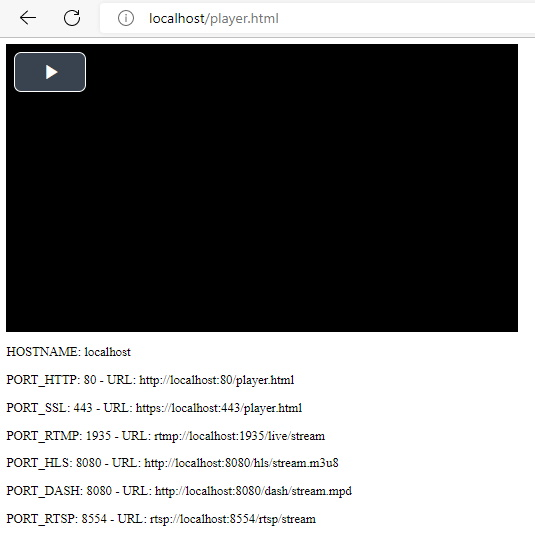

2. Moreover, you can see on this page, the list of URLs to play the same video using a different streaming protocol like:
   Local Urls:
    - RTMP: rtmp://localhost:1935/live/stream - players: ffplay, VLC
    - RTSP: rtsp://localhost:8554/rtsp/stream - players: ffplay, VLC
    - HLS: http://localhost:8080/hls/stream.m3u8 - players: Browser, ffplay, VLC
    - DASH: http://localhost:8080/dash/stream.mpd - players: ffplay

   Virtual Machine Urls:
    - RTMP: rtmp://eva<4digits>vm.eastus2.cloudapp.azure.com:1935/live/stream - players: ffplay, VLC
    - RTSP: rtsp://eva<4digits>vm.eastus2.cloudapp.azure.com:8554/rtsp/stream - players: ffplay, VLC
    - HLS: http://eva<4digits>vm.eastus2.cloudapp.azure.com:8080/hls/stream.m3u8 - players: Browser, ffplay, VLC
    - DASH: http://eva<4digits>vm.eastus2.cloudapp.azure.com:8080/dash/stream.mpd - players: ffplay

3. You can also check whether the video recording is fully functionning. From the Azure Portal, navigate to the Storage account and to the container "record". You should see the video chunks on the sotrage account.

    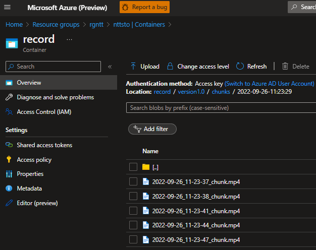    

4. You can also check whether the AI model detected some objects. From the Azure Portal, navigate to the Storage account and to the container "result". You should see the frame (jpg file) and the analysis result (json file) on the sotrage account.

    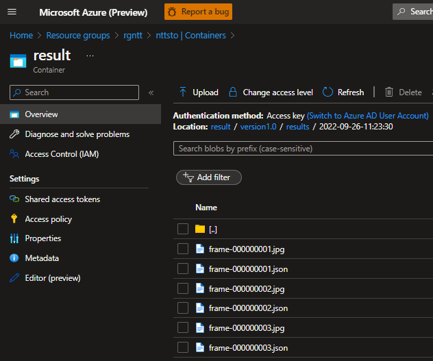

#### Testing with the Web Application

By default, the solution is deployed with a container running the Web App. This container called "webapp-container" hosts the Web Application which is used to check whether the video ingestion, the AI analysis and the recording are fully functionning.

##### Video Ingestion

On the Live page, you can play the video feeds coming from the cameras using the following urls:
- http://localhost:8084/ (local)
- http://eva<4digits>vm.<region>.cloudapp.azure.com:8084/ (virtual machine)


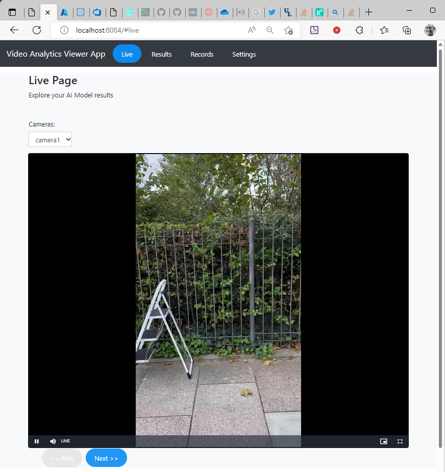

##### Video Ingestion

On the Results page, you can visualize the results of the frame analysis by:
- Yolov3
- Azure Computer Vision
- Azure Custom Vision

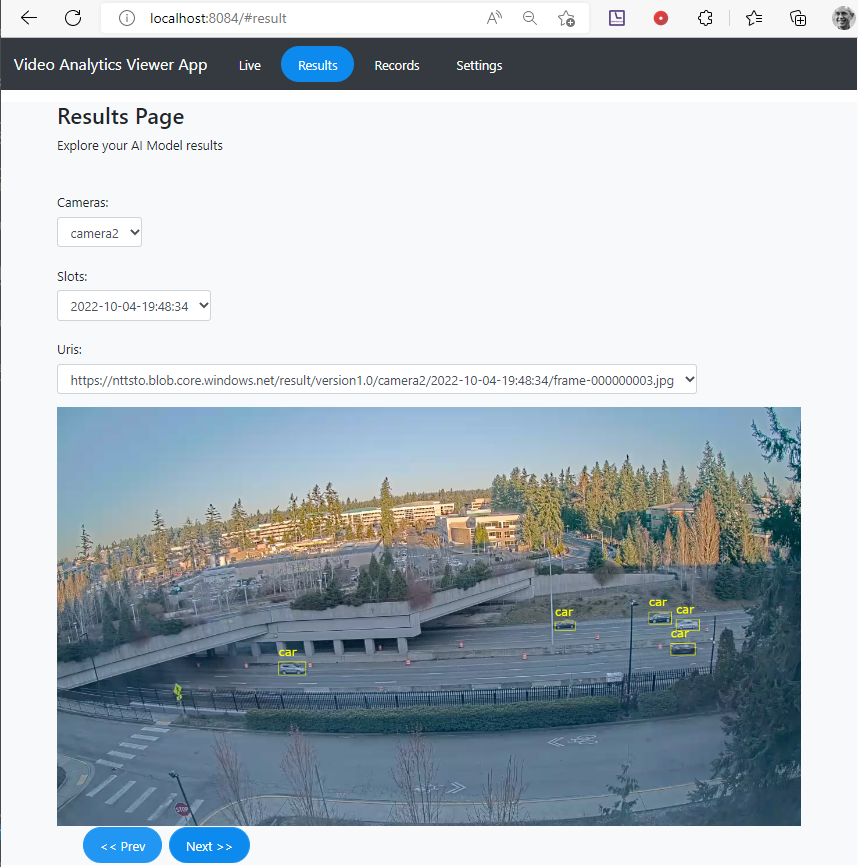

##### Video Recording

On the Records page, you can visualize the live video recorded on the Azure Storage.

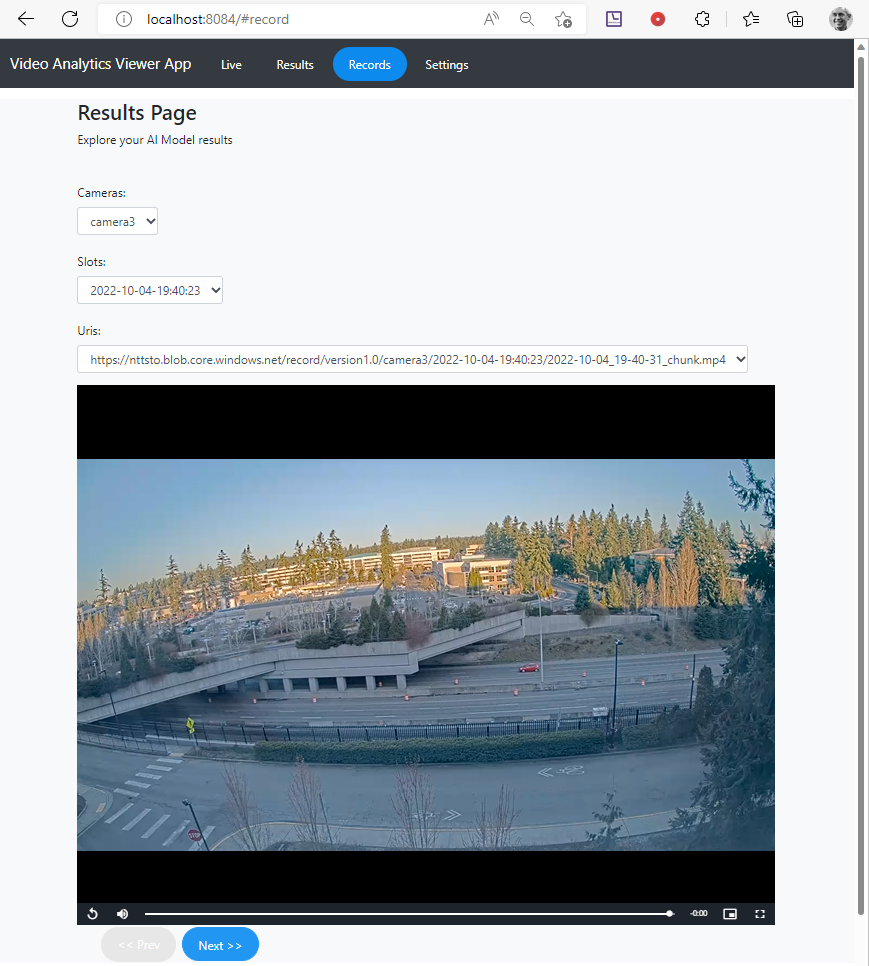

#### Testing the AI Models with curl

By default, the solution is deployed with 3 containers runing differnet Object Detections models:
- Yolov3
- Azure Computer Vision
- Azure Custom Vision

Using curl you can check whether the Object Detections services are fully functionning.

##### Testing Yolov3

Before testing Yolov3, you need to know the IP address and the TCP Port associated with Yolov3 container.
Run the following command from you devcontainer terminal.

``` 
    docker container inspect http-yolov3-onnx-container | jq -r '.[].NetworkSettings.Networks.bridge.IPAddress'
    docker container inspect http-yolov3-onnx-container | jq -r '.[].NetworkSettings.Ports'
``` 

Once you know the IP address and the TCP port, you can test the service using the following curl command using an image from the content folder in the repository.

The json string response from Yolo will start with '{"inferences":'

``` 
    curl -i -X POST http://172.17.0.4:8081/score -H 'Expect:' -H "Content-Type: image/jpeg" --data-binary @"./content/frame.jpg"

    {"inferences": [{"type": "entity", "entity": {"tag": {"value": "car", "confidence": 0.9402651190757751}, "box": {"l": 0.3611767842219426, "t": 0.5632959512563852, "w": 0.03565769929152269, "h": 0.013576764326829176}}}, {"type": "entity", "entity": {"tag": {"value": "car", "confidence": 0.8375570774078369}, "box": {"l": 0.7878504533034104, "t": 0.49765260402972883, "w": 0.031458487877478965, "h": 0.012661090263953576}}}, {"type": "entity", "entity": {"tag": {"value": "car", "confidence": 0.6296254992485046}, "box": {"l": 0.7492078634408804, "t": 0.5148971264178936, "w": 0.02511141850398137, "h": 0.012255411881666917}}}]}

``` 


##### Testing Computer Vision

Before testing Computer Vision, you need to know the IP address and the TCP Port associated with Computer Vision proxy container.
Run the following command from you devcontainer terminal.

``` 
    docker container inspect computer-vision-container | jq -r '.[].NetworkSettings.Networks.bridge.IPAddress'
    docker container inspect computer-vision-container | jq -r '.[].NetworkSettings.Ports'
``` 

Once you know the IP address and the TCP port, you can test the service using the following curl command using an image from the content folder in the repository.

The json string response from Yolo will start with '{"categories":'

``` 
    curl -i -X POST http://172.17.0.5:8082/score -H 'Expect:' -H "Content-Type: image/jpeg" --data-binary @"./content/frame.jpg"

    {"categories":[{"name":"outdoor_","score":0.03515625,"detail":{"landmarks":[]}},{"name":"outdoor_waterside","score":0.73046875,"detail":{"landmarks":[]}}],"objects":[],"requestId":"5616ea4a-3c38-4fd0-a351-e5fdcaa92d5e","metadata":{"height":720,"width":1280,"format":"Jpeg"},"modelVersion":"2021-05-01"}

``` 

You can also from your devcontainer terminal test directly the Computer Vision Service provided you know the following parameters:

- CUSTOM_VISION_PREDICTION_SERVICE_NAME: you can get this information from the Azure Portal
- CUSTOM_VISION_PREDICTION_PROJECT_ID: you can get this information from the "prediction URL" on the custom vision portal (https://www.customvision.ai/)
- CUSTOM_VISION_PREDICTION_ITERATION_NAME: you can get this information from the "prediction URL" on the custom vision portal (https://www.customvision.ai/)
- CUSTOM_VISION_PREDICTION_KEY: you can get this information from the "prediction URL" on the custom vision portal (https://www.customvision.ai/)

Running the following command:

``` 
    curl -i -X POST  --data-binary "@./content/frame.jpg" "https://{COMPUTER_VISION_SERVICE_NAME}.cognitiveservices.azure.com/vision/v3.2/analyze?visualFeatures=Objects&details=Landmarks&language=en&model-version=latest" -H "Content-Type: application/octet-stream" -H "Ocp-Apim-Subscription-Key: {COMPUTER_VISION_KEY}"

    {"categories":[{"name":"outdoor_","score":0.03515625,"detail":{"landmarks":[]}},{"name":"outdoor_waterside","score":0.73046875,"detail":{"landmarks":[]}}],"objects":[],"requestId":"42808dcd-65ac-4b24-aceb-3d9da38e9bdb","metadata":{"height":720,"width":1280,"format":"Jpeg"},"modelVersion":"2021-05-01"}

``` 

##### Testing Custom Vision

Before testing Custom Vision, you need to know the IP address and the TCP Port associated with Custom Vision proxy container.
Run the following command from you devcontainer terminal.

``` 
    docker container inspect custom-vision-container | jq -r '.[].NetworkSettings.Networks.bridge.IPAddress'
    docker container inspect custom-vision-container | jq -r '.[].NetworkSettings.Ports'
``` 

Once you know the IP address and the TCP port, you can test the service using the following curl command using an image from the content folder in the repository.

The json string response from Yolo will start with '{"categories":'

``` 
    curl -i -X POST http://172.17.0.6:8083/score -H 'Expect:' -H "Content-Type: image/jpeg" --data-binary @"./content/frame.jpg"

    {"id":"ce06abe7-8813-419c-8d1b-8856ae7f2702","project":"5d2fb5c1-8273-49b0-8dee-c39b40a6f876","iteration":"193cd765-a89c-43a9-9e45-b7705f0841c8","created":"2022-10-05T14:19:10.810Z","predictions":[{"probability":0.061713934,"tagId":"08e08234-cda3-42dd-b036-d22d5853f773","tagName":"ladder","boundingBox":{"left":0.13520098,"top":0.027334869,"width":0.74326086,"height":0.9151208}},{"probability":0.0121720135,"tagId":"08e08234-cda3-42dd-b036-d22d5853f773","tagName":"ladder","boundingBox":{"left":0.2800629,"top":-0.09190044,"width":0.46480322,"height":0.8521081}}]}

``` 

You can also from your devcontainer terminal test directly the Custom Vision Service provided you know the following parameters:

- CUSTOM_VISION_PREDICTION_SERVICE_NAME: you can get this information from the Azure Portal
- CUSTOM_VISION_PREDICTION_PROJECT_ID: you can get this information from the "prediction URL" on the custom vision portal (https://www.customvision.ai/)
- CUSTOM_VISION_PREDICTION_ITERATION_NAME: you can get this information from the "prediction URL" on the custom vision portal (https://www.customvision.ai/)
- CUSTOM_VISION_PREDICTION_KEY: you can get this information from the "prediction URL" on the custom vision portal (https://www.customvision.ai/)

Running the following command:

``` 
    curl -i -X POST  --data-binary "@./content/frame.jpg" https://{CUSTOM_VISION_PREDICTION_SERVICE_NAME}.cognitiveservices.azure.com/customvision/v3.0/Prediction/{CUSTOM_VISION_PREDICTION_PROJECT_ID}/detect/iterations/{CUSTOM_VISION_PREDICTION_ITERATION_NAME}/image -H "Content-Type: application/octet-stream" -H "Prediction-Key: {CUSTOM_VISION_PREDICTION_KEY}"

    {"id":"cb3b13c5-5eb6-4400-966d-303aae8849b5","project":"5d2fb5c1-8273-49b0-8dee-c39b40a6f876","iteration":"193cd765-a89c-43a9-9e45-b7705f0841c8","created":"2022-10-05T14:20:46.897Z","predictions":[{"probability":0.061713934,"tagId":"08e08234-cda3-42dd-b036-d22d5853f773","tagName":"ladder","boundingBox":{"left":0.13520098,"top":0.027334869,"width":0.74326086,"height":0.9151208}},{"probability":0.0121720135,"tagId":"08e08234-cda3-42dd-b036-d22d5853f773","tagName":"ladder","boundingBox":{"left":0.2800629,"top":-0.09190044,"width":0.46480322,"height":0.8521081}}]}

``` 

#### Testing with new video 

This chapter describes how to change the videos used to feed the system.

##### Preparing the video 

If you want to use a new video, you need first to prepare the video to support constant bitrate, you can use ffmpeg to encod the video, below the syntax used to call ffmpeg for this preparation: 


```bash 
    ffmpeg -i [input-video-file]  -map 0:v  -b:v [bitrate] -r [framerate] -vcodec libx264 -g [framerate]*2  -vf format=yuv420p [output-video-file]    
``` 

The options '-vcodec mpeg4' and '-vf format=yuv420p' are used to be sure to generate a MP4 file playable with Windows Media Player.
The option '-g [framerate]*2 ' is set to define the gop size. It means an Key frame every 2 seconds when the frame rate is 25 fps.

The command below displays the pts information per frame:

```bash 
    ffprobe  -i [input-video-file]  -show_frames -show_entries frame=pts_time,key_frame
``` 


As we don't need any audio track in the new video, the audio track will be removed from the new video file.
You can also define the new bitrate and the new framerate.

For instance:

```bash 
    ffmpeg -i fence1-ladder-front.MOV -map 0:v  -b:v 6000000  -vcodec libx264 -g 50 -r 25  -vf format=yuv420p -y fence1-ladder-front.mp4
``` 

Regarding the frame extraction, below some useful ffmpeg commands:

The command below extract all the B, P, and I frames in the input video file and the timestamp is stored in the frame file name is in milliseconds.

```bash 
    ffmpeg -y -i [input-video-file] -vsync 0  -vf select="eq(pict_type\,B)+eq(pict_type\,P)+eq(pict_type\,I)" -r 1000  -frame_pts 1 output\f-%12d.jpg
```

The command below extract one frame every 50, if the frame rate is 25 fps, it will generate a file every 2 seconds.

```bash
    ffmpeg -y -i [input-video-file] -vsync 0  -vf select="not(mod(n\,50))" -r 1000  -frame_pts 1 output\f-%09d.jpg
``` 

The command below extract one frame every 50 from a live feed using a global timestamp  , if the frame rate is 25 fps, it will generate a file every 2 seconds.

```bash
    ffmpeg -use_wallclock_as_timestamps 1 -i  [input-video-file] -copyts -vsync passthrough -vf select="not(mod(n\,50))" -r 1  -frame_pts 1 output\live-%12d.jpg
```

The first command below extract video chunks from the input rtsp stream, the timestamps in the recorded chunks files are absolute timestamps (number of seconds sine the January 1st 1970).
The second command extract the timestamp of the first frame. This value can be used to rename the recorded file.

```bash
    ffmpeg -use_wallclock_as_timestamps 1 -i [input-rtsp-stream]  -c copy -copyts -vsync passthrough -f segment -segment_time [perido_seconds] /content/chunks/live_%d_chunk.mp4

    eval $(ffprobe  -v error -hide_banner  -i /content/chunks/live_1_chunk.mp4  -show_entries frame=pkt_pts_time | grep pkt_pts_time | head -n 1)
    echo $pkt_pts_time
```

###### Extract Frame

You can also use extract frame container to extract frame with wallclock timestamp.

To build the container, use the following command line:
```bash
    cd ./envs/container/extractframe/ubuntu
    docker build   -f ./Dockerfile . -t av-services/extractframe-image:latest
```

To use the extract frame container to extract frame from a rtps stream, use the following command line:
```bash
    docker run --rm -it --name extractframe-container -v content-volume:/content  av-services/extractframe-image:latest -i rtsp://eva2463vm.eastus2.cloudapp.azure.com:554/media/fence.mp4 -e 25 -s -o /content/rtsp-frame-%s.jpg
```

Result:

```bash

    Timestamp: 01667563646.415457 - Start Frame detected
    Timestamp: 01667563647.415457 - Creating file: /content/rtsp-frame-01667563647.415457-00000000000.000000.jpg
    Timestamp: 01667563648.535457 - Creating file: /content/rtsp-frame-01667563648.535457-00000000001.120000.jpg
    Timestamp: 01667563649.575457 - Creating file: /content/rtsp-frame-01667563649.575457-00000000002.160000.jpg
    Timestamp: 01667563650.455457 - Creating file: /content/rtsp-frame-01667563650.455457-00000000003.040000.jpg
    Timestamp: 01667563651.535457 - Creating file: /content/rtsp-frame-01667563651.535457-00000000004.120000.jpg
    Timestamp: 01667563652.455457 - Creating file: /content/rtsp-frame-01667563652.455457-00000000005.040000.jpg
    Timestamp: 01667563653.495457 - Creating file: /content/rtsp-frame-01667563653.495457-00000000006.080000.jpg
    Timestamp: 01667563654.415457 - Creating file: /content/rtsp-frame-01667563654.415457-00000000007.000000.jpg
    Timestamp: 01667563654.739148 - Start Frame detected
    Timestamp: 01667563655.739148 - Creating file: /content/rtsp-frame-01667563655.739148-00000000000.000000.jpg
    Timestamp: 01667563656.859148 - Creating file: /content/rtsp-frame-01667563656.859148-00000000001.120000.jpg
    Timestamp: 01667563657.899148 - Creating file: /content/rtsp-frame-01667563657.899148-00000000002.160000.jpg

```

To use the extract frame container to extract frame from a mp4 file, use the following command line:
```bash
    docker run --rm -it --name extractframe-container -v content-volume:/content  av-services/extractframe-image:latest -i /content/fence.mp4 -e 25 -s -o /content/file-frame-%s.jpg
```

Result:

```bash
    Timestamp: 00000000000.000000 - Start Frame detected
    Timestamp: 00000000001.000000 - Creating file: /content/file-frame-00000000001.000000-00000000000.000000.jpg
    Timestamp: 00000000002.000000 - Creating file: /content/file-frame-00000000002.000000-00000000001.000000.jpg
    Timestamp: 00000000003.000000 - Creating file: /content/file-frame-00000000003.000000-00000000002.000000.jpg
    Timestamp: 00000000004.000000 - Creating file: /content/file-frame-00000000004.000000-00000000003.000000.jpg
    Timestamp: 00000000005.000000 - Creating file: /content/file-frame-00000000005.000000-00000000004.000000.jpg
    Timestamp: 00000000006.000000 - Creating file: /content/file-frame-00000000006.000000-00000000005.000000.jpg
    Timestamp: 00000000007.000000 - Creating file: /content/file-frame-00000000007.000000-00000000006.000000.jpg
    Timestamp: 00000000008.000000 - Creating file: /content/file-frame-00000000008.000000-00000000007.000000.jpg

```


The first command below create a mp4 file with only black frames and a duration of 1 seconds. Moreover the first frame is a key frame.
The second command encod and existing video to be compliant with the demonstration requirements: constant bitrate, 25 frame per second, the first frame is a key frame, pixel format yuv420p.
The third command merge the two previous videos. The final video will start with black frames during 1 seconds, this serie of frame will be used to synchronize the videos.

```bash
    ffmpeg -f lavfi -i color=c=black:s=1080x1920:r=25:d=1 -force_key_frames 00:00:00.000 -map 0:v  -b:v 4000000  -vcodec libx264 -g 25 -r 25  -vf format=yuv420p -y prevideo.mp4

    ffmpeg -i fence1-ladder-front.MOV -force_key_frames 00:00:00.000 -map 0:v  -b:v 4000000 -r 25 -vcodec libx264 -g 25  -vf format=yuv420p -y fence1-ladder-front.mp4
    ffmpeg -i prevideo.mp4 -i fence1-ladder-front.mp4 -filter_complex "[0:v] [1:v] concat=n=2:v=1 [v]" -map "[v]"  -g 25 output-fence1-ladder-front.mp4

```

##### Deploying the new video 

Once the video is prepared, you need to deploy the video in the system. Below the different steps to deploy the video file in the virtual machine.

1. Copy the video file under the content folder in the repository

2. Update the file evatool.sh to upload the new file in the Azure Storage.
Add the line below in the "vmdeploy" section to upload the new video file.

```bash 
    az storage blob upload --overwrite --no-progress --account-name "$AZURE_STORAGE_ACCOUNT"    --auth-mode login   --container-name "$AZURE_CONTENT_STORAGE_CONTAINER"  --file ${BASH_DIR}/../../../content/[videofile] --name [videofile]  --output none
    printMessage "File: fence.mp4 uploaded"
``` 

3. Update the file config/.avtoolconfig to configure the container rtsp-server to stream the new video file.
Add the new video file in the configuration of the ffmpeg container and the rtsp server see below:

```bash 

    AV_FFMPEG_INPUT_LIST=rtsp://[newvideofile],rtsp://fence.mp4

    AV_RTSP_SERVER_FILE_LIST=[newvideofile],fence.mp4

``` 

4. Now you need to deploy the new evatool.sh and the confguration file .avtoolconfig to the virtual machine. From the devcontainer terminal run the following command:

```bash 

    ./evatool.sh -a vmdeploy

``` 

This command will upload the new evatool.sh file and the new configuration file on the Azure Storage under the "content" container.
Once all the files are uploaded, the virtual machine will download those new files.

5. Now you need to deploy the new container to take into account the new video files, running the following commands:

```bash 

    ./evatool.sh -a vmremove
    ./evatool.sh -a vmbuild
    ./evatool.sh -a vmcreate

``` 
6. Using the Web App or the Player you can check whether the new video file is streamed.  
Open one of the urls below:  

    http://eva<4digits>vm.<region>.cloudapp.azure.com:8084/  
    http://eva<4digits>vm.<region>.cloudapp.azure.com:80/player.html  


# Next Steps

Below a list of possible improvements:  

1. Record playable video chunks on Azure Storage using DASH procotol
2. Use more efficient Object Detection Models
3. Improve the pipeline performance (don't store frame nor result file on local disk, reference each chunk, frame and result file with a timestamp).
4. Add a Web UI to display the result of the Analysis.
5. A GPU based demonstration to improve the performances.
