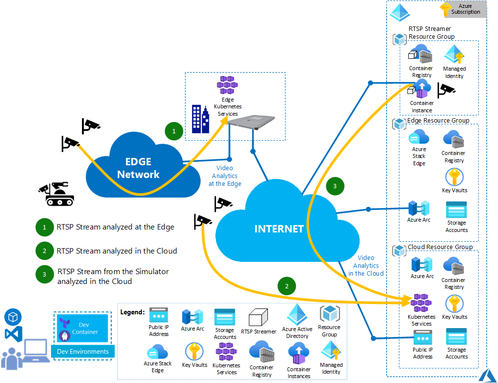

# Using RTSP Live Streamer to test Video Analytics Services

When you design, develop, test Video Analytics services running in the Cloud or at the Edge, you may need to simulate the video streams coming from the cameras. This article describes how to use the RTSP Live Streamer to simulate the RTSP Live Stream to test services consuming RTSP Live streams. For instance, the RTSP Live Streamer could be used to simulate several cameras streaming Live video streams towards a backend hosting a Video Analytics service.

## Architecture of the system with the RTSP Live Streamer

For the sample architecture below, the video analytics service is running at the Edge on Azure Stack Edge and in the cloud. 

*Download a [SVG file](./docs/img/rtsp-live-streamer-content/solution-idea-architecture.svg) of this architecture.*

### Video workflows

1. The streams associated to the cameras connected to the Edge network can be analyzed by the Video Analytics backend at the Edge on the Kubernetes Service running on the Azure Stack Edge.
2. The streams associated to the cameras connected to Internet can be analyzed by the Video Analytics backend in the cloud on Azure Kubernetes Service.
3. The RTSP Live Streamer running in a container in Azure Container Instance in the cloud can be used to stream RTPS Live streams towards the Video Analytics Service in the Cloud.
   
### Components

* [Azure Container Registry](https://azure.microsoft.com/en-us/products/container-registry): Build, store, secure, scan, replicate, and manage container images and artifacts.
* [Azure Container Instances](https://azure.microsoft.com/en-us/products/container-instances): Develop apps fast without managing virtual machines or having to learn new tools—it's just your application, in a container, running in the cloud.
* [Azure Blob Storage](https://azure.microsoft.com/products/storage/blobs): A massively scalable object storage for any type of unstructured data, including images, videos, audio, documents, and more. It's easy and cost effective.
* [Azure Key Vault](https://azure.microsoft.com/en-us/products/key-vault/):
Safeguard cryptographic keys and other secrets used by cloud apps and services.
* [Azure Kubernetes Service](https://azure.microsoft.com/products/kubernetes-service): The quickest way to start developing and deploying cloud-native apps in Azure, datacenters, or at the edge with built-in code-to-cloud pipelines and guardrails. 
* [Azure Arc](https://azure.microsoft.com/en-us/products/azure-arc/): Azure Arc is a bridge that extends the Azure platform to help you build applications and services with the flexibility to run across datacenters, at the edge, and in multicloud environments. Develop cloud-native applications with a consistent development, operations, and security model. Azure Arc runs on both new and existing hardware, virtualization and Kubernetes platforms, IoT devices, and integrated systems. Do more with less by leveraging your existing investments to modernize with cloud-native solutions.

## Scenario details

For this scenario, the RTSP Live Streamer is used to emulate the streams from several cameras. With the RTSP Live Streamer it's not necessary to purchase several cameras to test the Video Analytics backend. Moreover, the RTSP Stream can stream different videos to test simultaneously different video analytics scenarios.
At least the RTSP Live Streamer doesn't require a huge infrastructure in cloud: a "Basic" Azure Container Registry and a Azure Container Instance are sufficient.

### Potential use cases

The RTSP Streamer can be used to test different Recognition As A Services in different industries, for instance:

* Traffic Analysis 
* Parking monitoring
* Passenger counter 
* On shelf object counting
* Person crossing zone
* Person tracking 
* anomaly detection

## Considerations

These considerations implement the pillars of the Azure Well-Architected Framework, which is a set of guiding tenets that can be used to improve the quality of a workload. For more information, see [Microsoft Azure Well-Architected Framework](https://learn.microsoft.com/azure/architecture/framework).

### Cost optimization

Cost optimization is about looking at ways to reduce unnecessary expenses and improve operational efficiencies. For more information, see [Overview of the cost optimization pillar](https://learn.microsoft.com/azure/architecture/framework/cost/overview).

Use the [Azure pricing calculator](https://azure.com/e/e146fd5535974f1dae5e32a06efb424d) to get customized pricing estimates. 

## Next steps

The [RTSP](https://en.wikipedia.org/wiki/Real_Time_Streaming_Protocol) Streamer container can be extended to support other output streaming protocols like:
- [RTMP](https://wikipedia.org/wiki/Real_Time_Messaging_Protocol)
- [HLS](https://en.wikipedia.org/wiki/HTTP_Live_Streaming)
- [DASH](https://en.wikipedia.org/wiki/Dynamic_Adaptive_Streaming_over_HTTP)

## Related resources

- [RTSP Live Streamer sample project - to be completed](https://)
