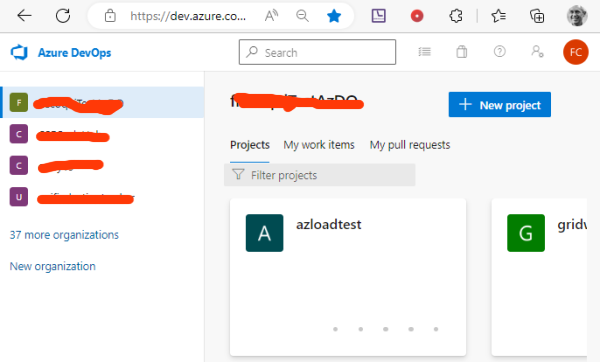
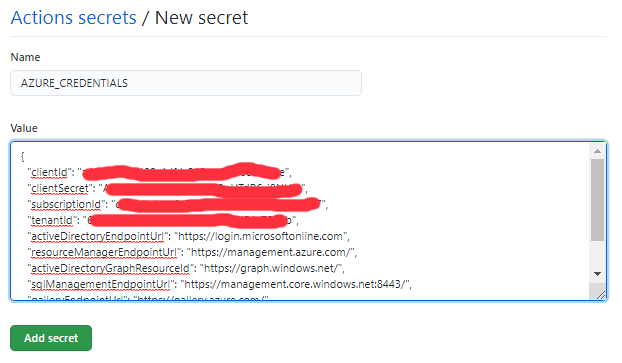
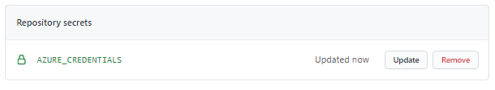
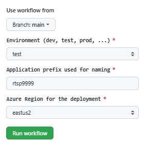

# Using RTSP Live Streamer to test Video Analytics services  

## Table of Contents

- [Introduction](#introduction)
- [Overview](#overview)
- [Getting started](#getting-started)
- [Using Azure DevOps pipelines and Github Actions](#using-azure-devops-pipelines-and-github-actions-to-run-the-rtsp-live-streamer)
- [Under the hood](#under-the-hood)
- [Contribute](#contribute)
- [Next Steps](#next-steps)

## Introduction

When you are involved in project consuming video streams from cameras, oftentimes your system needs to support [RTSP](https://en.wikipedia.org/wiki/Real_Time_Streaming_Protocol) protocol. This repository describes how to use a RTSP Streamer to simulate the live video streams coming from cameras. The RTSP Streamer is a light solution running in a container and simulates live RTSP streams with streaming loops of MP4 files.
Moreover in order to do more with less this repository contains two image flavors of the RTSP Streamer container:
- one image based on Ubuntu
- one image based on Alpine which consumes less memory and less storage capacity.

This repository contains:
  - a Visual Studio Code dev container to deploy manually the infrastructure (Azure Container Registry), build the image and deploy the image on Azure Container Instance, test the RTSP Streamer with ffmpeg.
  - the bash file to encode the video files into MP4 files supporting constant bitrate and constant keyframe distance to offer a better video experience.
  - the Azure DevOps Pipeline to deploy and run the RTSP Live Streamer.
  - the Github Action to deploy and run the RTSP Live Streamer.

## Features and architectures

This chapter describes the architecture based on Azure Container Register and Azure Container Instance.
Once the RTSP Streamer is running on Azure Container Instance, it can deliver Live RTSP streams using the following urls:

```bash
    rtsp://${DNS_NAME}:${RTSP_SERVER_PORT}/media/${RTSP_MP4_FILE}
```
where:
  DNS_NAME is the FQDN of the Azure Container Instance hosting the container
  RTSP_SERVER_PORT is the RTSP port (554 by default)
  RTSP_MP4_FILE is one of the MP4 files copied in the container.

  

*Download a [SVG file](./docs/img/rtsp-live-streamer/architecture.svg) of this diagram.*

This repository doesn't contain the code used to consume the RTSP live video streams.
You can consume those RTSP streams using ffmpeg in the dev container using the following command line:

```bash
    ffprobe -i rtsp://${DNS_NAME}:${RTSP_SERVER_PORT}/media/${RTSP_MP4_FILE}
```

## Getting started

This chapter describes how to :

1. Install the pre-requisites including Visual Studio Code, Dev Container
2. Create, deploy and run the different pipelines
  
This repository contains the following resources :

- A Dev container under '.devcontainer' folder
- The pipelines (Azure DevOps pipeline, Github Action) used to run the RTSP Streamer scenarios and the bash files used to create and run the pipelines under 'devops-pipelines' folder
- The bash file to create the Azure Service Principal used for the pipeline authentication
- The bash file to create the Azure DevOps service connection, variable group and pipelines.

### Installing the pre-requisites

In order to test the solution, you need first an Azure Subscription, you can get further information about Azure Subscription [here](https://azure.microsoft.com/en-us/free).

You also need to install Git client on your machine and Visual Studio Code, below the links.

|[](https://git-scm.com/download/win) |[](https://git-scm.com/download/linux)|[](https://git-scm.com/download/mac)  |
| :--- | :--- | :--- |
| [Git Client for Windows](https://git-scm.com/download/win) | [Git client for Linux](https://git-scm.com/download/linux)| [Git Client for MacOs](https://git-scm.com/download/mac) |
[Visual Studio Code for Windows](https://code.visualstudio.com/Download)  | [Visual Studio Code for Linux](https://code.visualstudio.com/Download)  &nbsp;| [Visual Studio Code for MacOS](https://code.visualstudio.com/Download) &nbsp; &nbsp;|

Once the Git client is installed you can clone the repository on your machine running the following commands:

1. Create a Git directory on your machine

    ```bash
        c:\> mkdir git
        c:\> cd git
        c:\git>
    ```

2. Clone the repository.  
    For instance:

    ```bash
        c:\git> git clone https://CSECodeHub@dev.azure.com/CSECodeHub/528239%20-%20NTT%20Airport%20Security%20Autonomous%20Fence%20Inspection%20using/_git/rtsp-live-streamer
        c:\git> cd ./rtsp-live-streamer 
        c:\git\rtsp-live-streamer> 
    ```

### Using dev container

This repository contains a folder called '.devcontainer'.

When you'll open the project with Visual Studio Code, it will ask you to open the project in container mode provided some pre-requisites are installed on your machine.

#### Installing Visual Studio Code and Docker

You need to install the following pre-requisite on your machine

1. Install and configure [Docker](https://www.docker.com/get-started) for your operating system.

   - Windows / macOS:

     1. Install [Docker Desktop](https://www.docker.com/products/docker-desktop) for Windows/Mac.

     2. Right-click on the Docker task bar item, select Settings / Preferences and update Resources > File Sharing with any locations your source code is kept. See [tips and tricks](https://code.visualstudio.com/docs/remote/troubleshooting#_container-tips) for troubleshooting.

     3. If you are using WSL 2 on Windows, to enable the [Windows WSL 2 back-end](https://docs.docker.com/docker-for-windows/wsl/): Right-click on the Docker taskbar item and select Settings. Check Use the WSL 2 based engine and verify your distribution is enabled under Resources > WSL Integration.

   - Linux:

     1. Follow the official install [instructions for Docker CE/EE for your distribution](https://docs.docker.com/get-docker/). If you are using Docker Compose, follow the [Docker Compose directions](https://docs.docker.com/compose/install/) as well.

     2. Add your user to the docker group by using a terminal to run: sudo usermod -aG docker $USER

     3. Sign out and back in again so your changes take effect.

2. Install [Visual Studio Code](https://code.visualstudio.com/).

3. Install the [Remote Development extension pack](https://marketplace.visualstudio.com/items?itemName=ms-vscode-remote.vscode-remote-extensionpack)

#### Using devcontainer

1. Launch Visual Studio Code in the folder where you stored the av-services repository

    ```bash
        c:\git\rtsp-live-streamer> code .
    ```

2. Once Visual Studio Code is launched, you should see the following dialog box:

    

3. Click on the button 'Reopen in Container'
4. Visual Studio Code will now open the devcontainer. If it's the first time you open the project in container mode, it will first build the container, it can take several minutes to build the new container.
5. Once the container is loaded, you can open a new terminal (Terminal -> New Terminal).
6. And you have access to the tools installed in the devcontainer like az client,....
You can run 'az login' to connect your devcontainer with your Azure Subscription. 

    ```bash
        vscode ➜ /workspace $ az login
    ```

### How to run the RTSP Live Streamer 

This chapter describes how to run the RTSP Live Streamer from the devcontainer.

#### Preparing the MP4 files 

Before building the RTSP Streamer container image, you need to define the list of MP4 files you want to use to emulate live RTSP Stream.
By default, the MP4 files are stored under ./content/input. The bash files building the images will copy the MP4 files under ./content/input into the container image.

The default MP4 files (encoded-camera-300s.mp4, encoded-lots_015.mp4, encoded-lots_284.mp4) have been created from the files camera-300s.mkv, lots_015.mkv, lots_284.mkv using the bash file []./content/encode.sh](./content/encode.sh).

The mkv files are encoded using the following ffmpeg command line in the function encodevideo():

```bash
    ffmpeg -i ${ARG_INPUT_FILE} -pix_fmt yuv420p -force_key_frames 00:00:00.000 -t ${ARG_DURATION} -filter:v fps=${ARG_FRAME_RATE}   -force_key_frames \"expr:gte(t,n_forced*1)\" -c:v libx264 -preset veryslow -x264-params "nal-hrd=cbr:force-cfr=1" -b:v ${ARG_BITRATE} -minrate ${ARG_BITRATE} -maxrate ${ARG_BITRATE} -bufsize 600k   -y ${ARG_OUTPUT_FILE}  -v error
```

where :
  ARG_INPUT_FILE is the path of the input MKV file
  ARG_DURATION is the max duration in seconds of the output file (default value 120 seconds)
  ARG_FRAME_RATE is the input frame rate (default value 25 frame per second)
  ARG_BITRATE is the bitrate of the output MP4 file in bit/s (3000000 bit/second)
  ARG_OUTPUT_FILE is the path of the output MP4 file 


Using the same ffmpeg command line you can prepare your own MP4 files to emulate the RTSP Live Stream provided you copy the new MP4 files under the folder ./content/input.

#### Running the container locally on your machine running Docker

Once the folder ./content/input contains all the MP4 files you want to use for your test, you can test the RTSP Streamer locally on your machine from the devcontainer.

1. In the devcontainer terminal change the current directory to  ./envs/container/docker/rtspserver/ubuntu
```bash
  cd ./envs/container/docker/rtspserver/ubuntu/
```

2. Run the bash file  ./run-rtsp-server-local.sh
For each MP4 video file, the bash file display the urls associated with the MP4 file: 
```bash
    Run the following command from a local container:
      ffprobe -i rtsp://172.17.0.3:554/media/encoded-lots_284.mp4
    Run the following command from the host:
      ffprobe -i rtsp://127.0.0.1:554/media/encoded-lots_284.mp4
```

3. Once the container is built and running on your local machine. Run 'docker ps' to check whether your RTPS Streamer container is running locally.

4. To test whether the RTSP Streamer container is streaming your content, you can use the following command from your devcontainer terminal:
The IP address in the hostname of the url is actually in local IP of the container.

```bash
    ffprobe -i rtsp://172.17.0.3:554/media/encoded-lots_284.mp4
```
If you want to test the same stream from you machine you need to use the IP address 127.0.0.1 and the following command line:

```bash
    ffprobe -i rtsp://127.0.0.1:554/media/encoded-lots_284.mp4
```
You can also use any Video Player supporting RTSP to playback the Video Stream. For instance, you can use VLC to playback the RTSP Video Stream.
You can also use ffplay to playback the stream:

```bash
    ffplay rtsp://127.0.0.1:554/media/encoded-lots_284.mp4
```
5. Don't forget to stop the container on your local machine if you don't use it any more running the command:

```bash
    docker stop rtspserver-container
```

So far, we use the Ubuntu based container, if you want to consume less memory and less storage capacity, you can use the Alpine based container under folder ./envs/container/docker/rtspserver/ubuntu/. Run the steps form 1 to 5 to test the Alpine based container.

Using the following commands docker will display the size of each image:

```bash
   docker inspect analyzer/rtspserver-ubuntu-image:latest  | jq '.[].Size'
   docker inspect analyzer/rtspserver-alpine-image:latest  | jq '.[].Size'
```

#### Running the container in cloud

If you want to test the same container images in the cloud, you can use the bash file called 'run-rtsp-server-azure.sh' from the devcontainer terminal. This bash file will deploy the infrastructure first (Azure Container Registry), then it will build the container image and push the image to the container registry in the cloud, finally it will create the Azure Container instance to run the container in the cloud.

1. In the devcontainer terminal change the current directory to  ./envs/container/docker/rtspserver/ubuntu
```bash
  cd ./envs/container/docker/rtspserver/ubuntu/
```

2. Run az login to connect your devcontainer with your Azure Subscription
```bash
  az login
```

3. Run the bash file  ./run-rtsp-server-azure.sh
Once connected to Azure, you can run the following bash file. By default, this bash file will use the string 'rtsp9999' to name the different resources in Azure (Resource Group, Azure Container Registry, Azure Container Instance). The infrastructure deployment may fail if some resources with the same name are already deployed in Azure. You can still change the value of AZURE_APP_PREFIX in the bash file to change the value of this string.
```bash
    ./run-rtsp-server-azure.sh
```

4. Once the infrastructure is deployed, the container is built and running in Azure, you can test whether the RTSP Streamer container is streaming your content, you can use the following command from your devcontainer terminal:

The hostname of the url is actually in DNS name of your Azure Container Instance.

```bash
    ffprobe -i rtsp://acirtsp9999test.eastus2.azurecontainer.io:554/media/encoded-lots_284.mp4
```

You can also use any Video Player supporting RTSP to playback the Video Stream. For instance, you can use VLC to playback the RTSP Video Stream.
You can also use ffplay to playback the stream:

```bash
    ffplay rtsp://acirtsp9999test.eastus2.azurecontainer.io:554/media/encoded-lots_284.mp4
```
5. Don't forget to remove the Azure Resources if you don't use the container any more using the az cli command 'az group delete'. For instance:

```bash
    az group delete --resource-group rgrtsp9999test
```

So far, we use the Ubuntu based container, if you want to consume less memory and less storage capacity, you can use the Alpine based container under folder ./envs/container/docker/rtspserver/ubuntu/. Run the steps form 1 to 5 to test the Alpine based container.

#### Using RTSP Streamer to stream live content from your Web Cam

When the container is deployed and running in the cloud, you can use the RTSP server running in the RTSP Streamer container to stream a live feed from your WebCam. Below the steps to stream live content from your WebCam on Windows.

1. Install [ffmpeg](https://www.ffmpeg.org/) on your machine running Windows.
2. List your video and audio devices on your machine using the following command:

```bash
    ffmpeg -list_devices true -f dshow -i dummy
```

This command will list the devices available on your machine:

```
  [dshow @ 000001f37d4feb40] "Integrated Webcam" (video)
  [dshow @ 000001f37d4feb40]   Alternative name "@device_pnp_\\?\usb#vid_1bcf&pid_28c4&mi_00#6&1da11eb4&0&0000#{65e8773d-8f56-11d0-a3b9-00a0c9223196}\global"
  [dshow @ 000001f37d4feb40] "Headset (HIFI Audio)" (audio)
  [dshow @ 000001f37d4feb40]   Alternative name "@device_cm_{33D9A762-90C8-11D0-BD43-00A0C911CE86}\wave_{9A3B460F-9296-4729-B6EE-0E026AB93D19}"
  [dshow @ 000001f37d4feb40] "Microphone Array (Realtek(R) Audio)" (audio)
  [dshow @ 000001f37d4feb40]   Alternative name "@device_cm_{33D9A762-90C8-11D0-BD43-00A0C911CE86}\wave_{3F386EEA-2AC6-44E9-9B73-C4AD2ACC61E2}"
```
Keep the name of your video device. 

2. List the modes (resolution, frame rate) with your video device using the following command:

```bash
  ffmpeg -f dshow -list_options true -i video="Integrated Webcam"
```

This command will list all the possible modes:

```
  [dshow @ 000002e7e654eb40] DirectShow video device options (from video devices)
  [dshow @ 000002e7e654eb40]  Pin "Capture" (alternative pin name "Capture")
  [dshow @ 000002e7e654eb40]   vcodec=mjpeg  min s=1280x720 fps=30 max s=1280x720 fps=30
  [dshow @ 000002e7e654eb40]   vcodec=mjpeg  min s=960x540 fps=30 max s=960x540 fps=30
  [dshow @ 000002e7e654eb40]   vcodec=mjpeg  min s=848x480 fps=30 max s=848x480 fps=30
  [dshow @ 000002e7e654eb40]   vcodec=mjpeg  min s=640x480 fps=30 max s=640x480 fps=30
  [dshow @ 000002e7e654eb40]   vcodec=mjpeg  min s=640x360 fps=30 max s=640x360 fps=30
  [dshow @ 000002e7e654eb40]   pixel_format=yuyv422  min s=640x480 fps=30 max s=640x480 fps=30
  [dshow @ 000002e7e654eb40]   pixel_format=yuyv422  min s=160x120 fps=30 max s=160x120 fps=30
  [dshow @ 000002e7e654eb40]   pixel_format=yuyv422  min s=320x180 fps=30 max s=320x180 fps=30
  [dshow @ 000002e7e654eb40]   pixel_format=yuyv422  min s=320x240 fps=30 max s=320x240 fps=30
  [dshow @ 000002e7e654eb40]   pixel_format=yuyv422  min s=424x240 fps=30 max s=424x240 fps=30
  [dshow @ 000002e7e654eb40]   pixel_format=yuyv422  min s=640x360 fps=30 max s=640x360 fps=30
```

Keep the input mode you want to use for the live stream experience.

3. You can now stream the feed from your webcam to the RTSP server using ffmpeg. As oftentimes the webcam doesn't support stream compliant with RTSP, ffmpeg will encode the live feed into a constant bitrate and a constant key frame distance stream. The command below extract the video with the resolution 1280x720 at a bitrate of 4 Mb/s. For this sample, the path of the live url is 'media/live'.

```bash
    ffmpeg -hide_banner -loglevel error  -f dshow -s 1280x720 -r 30 -vcodec mjpeg -i video="Integrated Webcam"  -pix_fmt yuv420p -force_key_frames 00:00:00.000  -filter:v fps=30   -force_key_frames "expr:gte(t,n_forced*1)" -c:v libx264 -b:v 4000000 -minrate 4000000 -maxrate 4000000 -bufsize 600k  -use_wallclock_as_timestamps 1 -f rtsp  rtsp://acirtsp9999test.eastus2.azurecontainer.io:554/media/live
```

4. Once ffmpeg is streaming the content on your machine, you can playback the same content streamed from the RTSP Live Streamer from a video player like VLC on your machine. 

    

## Using Azure DevOps pipelines and Github Actions to run the RTSP Live Streamer

At this stage, the infrastructure has been deployed on your Azure Subscription.
Now, with Azure DevOps pipeline and/or Github Action, we will automate:

- the deployment of the infrastructure
- the container image creation
- the container image deployment

The pipeline running RTSP Streamer testing will:

- deploy the infrastructure
- build the container image and store the container in Azure Container Registry  
- create the Azure Container Instance and deploy the RTSP Streamer image

### Creating the Service Principal for Github Action and Azure DevOps pipelines Azure Authentication  

If you want to use Azure DevOps pipelines or Github Actions, an authentication with Azure using a Service Principal is required.

In order to create this service principal you can use the following bash file: [devops-pipelines/utils/createrbacsp.sh](./devops-pipelines/utils/createrbacsp.sh)

Before running this bash file you need to be connected with your Azure Account using Azure CLI. Run 'az login' in your linux environment or in your Dev Container Terminal

```bash
    vscode ➜ /workspace $ az login
```

Once you are connected with Azure, you can run the following bash to create the Service Principal:

```bash
    vscode ➜ /workspace $ ./devops-pipelines/utils/createrbacsp.sh -s <Azure-Subscription-Id> -a <Service-Principal-Name>
```

where \<Azure-Subscription-Id\> is the subscriptionId of your Azure Account and \<Service-Principal-Name\> the name of the service principal which will be created.  
Once completed, this bash file will display the information required for the Azure authentication with GitHub Action and Azure DevOps pipeline.

For instance:

```bash
    vscode ➜ /workspace $ ./devops-pipelines/utils/createrbacsp.sh -s d3814ade-afe8-4260-9b5f-************ -a sp-rtsp-server-9999
```

The bash file will display the following information in Json format:

```bash
    {
    "clientId": "********-****-****-****-************",
    "clientSecret": "************",
    "subscriptionId": "********-****-****-****-************",
    "tenantId": "********-****-****-****-************",
    "activeDirectoryEndpointUrl": "https://login.microsoftonline.com",
    "resourceManagerEndpointUrl": "https://management.azure.com/",
    "activeDirectoryGraphResourceId": "https://graph.windows.net/",
    "sqlManagementEndpointUrl": "https://management.core.windows.net:8443/",
    "galleryEndpointUrl": "https://gallery.azure.com/",
    "managementEndpointUrl": "https://management.core.windows.net/"
    }
```

In the subsequent chapter, you'll see how to use this Json string to create the Github Action Secret AZURE_CREDENTIALS and how to use the clientId and clientSecret values to create the Azure DevOps Service Connection. 

The creation of this service principal with your Azure Account may fail with the following error: "insufficient privileges to complete the operation", in that case, you'll need to contact your Azure Active Directory Administrator to create the Service Principal for you.

### Azure DevOps pipeline

The service principal for the Azure DevOps pipeline has been created, you can use Azure DevOps to create the RTSP Streamer pipelines.

The diagram below describes the architecture for this test with with Azure DevOps:
-  a resource group containing the Azure Container Registry and Azure Container Instance running the RTSP Streamer container

  

*Download a [SVG file](./docs/img/rtsp-live-streamer/azure-devops-architecture.svg) of this diagram.*

#### **Link your Azure DevOps project with the GitHub repository**

1. Navigate on your Azure DevOps organization https://dev.azure.com/YOUR_ORG

    

2. Click on the button '+ New project'

3. On the 'Create new project' page enter the name of your project and click on the button 'Create'

    

4. On the main page of your project on Azure DevOps portal, select 'Repos' -> 'Files' page.

    

5. On this page, click on the 'import' button in the'Import a repository' section.

6. On the Import a Git repository page, enter the url of the git repository where you stored the source code of this project.

    

7. Click on the button 'Import', after few seconds the repository is imported.

You can now create the service connection for the authentication with your Azure Account, the Variable Group and the Azure DevOps pipeline.

#### **Create Azure DevOps Service Connection, Variable Group and pipeline**

In order to create the service connection, Variable Group and pipeline you can use the following bash file: [devops-pipelines/utils/createazdoresources.sh](./devops-pipelines/utils/createazdoresources.sh)
This bash file creates:
- the service connection for the authentication with Azure Subscription. The name of this service connection will be the name of the service principal created in the previous step with the prefix "sc-".
- the variable group which contains the parameters of the pipeline like SERVICE_CONNECTION. By default the name of this variable group is "rtsp-server-vg". If you want to change this name, you'll have to update the file [devops-pipelines/utils/createazdoresources.sh](./devops-pipelines/utils/createazdoresources.sh) and the pipeline file [azure-pipelines-rtsp-server-deployment](./devops-pipelines/azure-pipeline/azure-pipelines-rtsp-server-deployment.yml).
- the Azure DevOps pipeline to deploy the RTSP Streamer. By default, the name of the pipeline is "RTSP-Streamer". If you want to change this name, you'll have to update the file [devops-pipelines/utils/createazdoresources.sh](./devops-pipelines/utils/createazdoresources.sh). By default, the pipeline file should be present in the "main" branch, if it's not the case, you also need to update the file [devops-pipelines/utils/createazdoresources.sh](./devops-pipelines/utils/createazdoresources.sh).
  
Before running this bash file you need to be connected with your Azure Account using Azure CLI. Run 'az login' in your linux environment or in your Dev Container Terminal

```bash
    vscode ➜ /workspace $ az login
```

Once you are connected with Azure, you can run the following bash to create the Service Principal:

```bash
    vscode ➜ /workspace $ ./devops-pipelines/utils/createazdoresources.sh -o <MyORG> -p <MyProject> -y <MyRepository> -s <Azure-Subscription-Id>  -t <Azure-Tenant-Id> -i <ServicePrincipalId> -k <ServicePrincipalKey>
```

where:
- \<MyORG\> is the name of your DevOps organization,
- \<MyProject\> is the name of your project,
- \<MyRepository\> is the name of your repository where the pipeline is stored,
- \<Azure-Subscription-Id\> is the subscriptionId of your Azure Account,
- \<Azure-Tenant-Id\> is the Tenant Id of your Azure AD Tenant,
- \<ServicePrincipalId\> is the value "clientId" of your Service Principal created with the bash file [devops-pipelines/utils/createrbacsp.sh](./devops-pipelines/utils/createrbacsp.sh),
- \<ServicePrincipalKey\> is the value "clientSecret" of your Service Principal created with the bash file [devops-pipelines/utils/createrbacsp.sh](./devops-pipelines/utils/createrbacsp.sh),

For instance:

```bash
        vscode ➜ /workspace $ ./devops-pipelines/utils/createazdoresources.sh -o "RTSPOrg" -p "RTSP project" -y "rtsp-live-streamer" -s "d3814ade-afe8-4260-9b5f-xxxxxxxxxxxx"  -t "6a13df32-a807-43c4-8277-xxxxxxxxxxxx" -i "1d736738-9c5f-4de7-84f9-xxxxxxxxxxxx" -k "ok-8Q~Rsxxxxxxxxxxxx"
```

Once completed, this bash file will display the information about the different resources created.

```bash
  Creating Service Connection for:
    Subscription: d3814ade-afe8-4260-9b5f-xxxxxxxxxxxx
    Tenant: 6a13df32-a807-43c4-8277-xxxxxxxxxxxx
    Service Principal Id: 1d736738-9c5f-4de7-84f9-xxxxxxxxxxxx
  Creating Service Connection...
  Updating Service Connection to allow all pipelines...
  Creating Variables Group 'rtsp-server-vg' for:
    Organization: 'https://dev.azure.com/RTSPOrg/'
    Project: 'RTSP project'
  Creating Variables Group...
  Creating Pipeline 'RTSP-Streamer' for:
    Organization: 'https://dev.azure.com/RTSPOrg/'
    Project: 'RTSP project'
  Creating Pipeline...
  Pipeline 'RTSP-Streamer' created.
```

You can now check whether the service connection, the variable group and pipeline have been created.

1. On the main page of your project on Azure DevOps portal, select 'Project Settings' -> 'Service Connections' page. You should see the new service  connection with the prefix "sc-".  

    

1. On the main page of your project on Azure DevOps portal, select 'Pipelines' -> 'Library' page. You should see the new variable group "rtsp-server-vg".  

    

1. On the main page of your project on Azure DevOps portal, select 'Pipelines' -> 'Pipelines' page. You should see the new pipeline "RTSP-Streamer".  

    

1. You can now click on the "Run pipeline" button to run manually the pipeline.
1. On the dialog box 'Run pipeline',  
    - select the 'main' branch,
    - select the environment: 'dev','test', 'prod'
    - select the region for the deployment: 'westeurope', 'eastus2'
    - update the application prefix if necessary: by default rtsp9999    
  Then click on the button "Run"  

    

1. After few minutes, the pipeline is completed and you can see the available rtsp urls in the 'Deploy Image' stage.

    


### Github Action

You can also use Github Action to automate the deployment of the RTSP Streamer.

The diagram below describes the architecture for this test with Github Action:
-  a resource group containing the Azure Container Registry and Azure Container Instance running the RTSP Streamer container
  
  

*Download a [SVG file](./docs/img/rtsp-live-streamer/github-action-architecture.svg) of this diagram.*

First, you need to create the Github Action Secret AZURE_CREDENTIALS for the authentication with Azure.

#### Create Github Action Secret AZURE_CREDENTIALS

1. On the GitHub portal where you store your project, navigate on the the page 'Settings' and select the options 'Secrets'.

    

2. Click on 'New repository secret' button, enter 'AZURE_CREDENTIALS' in the Name field and copy/paste the JSON value associated with the service principal created with createrbacsp.sh.

    

3. Click on 'Add secret' button. The new secret will be accessible on the Secret page.  

    

#### Create Github Action pipeline for RTSP Streamer

By default, all the Github Action pipelines are stored under 'devops-pipelines/github-action'.
The RTSP Streamer Github Action pipeline is [github-action-rtsp-server-deployment.yml](devops-pipelines/github-action/github-action-rtsp-server-deployment.yml)

In order to activate this pipeline, follow the steps below:

1. Create a folder '.github/workflows' in your repository
2. Copy the file github-action-rtsp-server-deployment.yml in the folder '.github/workflows'
3. Commit and push this modification in your "main" branch

    ```bash
      git add  .github/workflows/github-action-rtsp-server-deployment.yml
      git commit -m "Create RTSP Streamer Github Action"
      git push
    ```
    
4. Once the new Github Action is pushed into the main branch, the Github Action 'RTSP-Streamer' is visible on the portal

    

5. You can launch manually the Github Action. On the GitHub portal, on the 'Action' page, select the workflow 'RTSP-Streamer' and click on the button 'Run workflow'. If required you can change the following input parameters:

    - select the 'main' branch,
    - select the environment: 'dev','test', 'prod'
    - select the region for the deployment: 'westeurope', 'eastus2'
    - update the application prefix if necessary: by default rtsp9999    
   - Github branch: main by default
   - Environment: 'dev','test', 'prod'
   - Azure Region: 'westeurope' or 'eastus2', 'eastus2' by default
   - Application prefix: rtsp9999 by default. Don't hesitate to change this value to avoid conflict  
  
   

5. After few minutes, the pipeline has been completed and you can see the RTSP urls available for your tests.  

    

## Under the hood

### Building the RTSP Streamer container

This chapter describes how the architecture of the container running the RTSP Live Streamer.

For every flavor ubuntu or alpine, 2 files are currently used to build the RTSP Streamer container:

- a [Dockerfile](./envs/container/docker/rtspserver/alpine/Dockerfile) used to install the RTSP server and ffmpeg 
- a [docker-entrypoint.sh](./envs/container/docker/rtspserver/alpine/docker-entrypoint.sh) which launches the RTSP Server and the ffmpeg processes to emulate a loop live stream.


The Dockerfile is a two stages Dockerfile, for the first stage, it installs the RTSP Server, for the second stage it configure the RTSP Server and install ffmpeg. 
The RTSP Server is built from the rtsp-simple-server, the release is downloaded from the github repository and  installed in the Docker image.
```
  RUN cd /tmp && \
    wget https://github.com/aler9/rtsp-simple-server/releases/download/v0.21.5/rtsp-simple-server_v0.21.5_linux_amd64.tar.gz && \
    tar xvfz rtsp-simple-server_v0.21.5_linux_amd64.tar.gz && \
    cp ./rtsp-simple-server /usr/local/bin/ && \
    cp ./rtsp-simple-server.yml /usr/local/bin/ 
```

During the second stage ffmpeg is installed and the RTSP Server is configured and the RTMP, HLS and WebRTC protocols are disabled.

```
  RUN apk update  \
    && apk add ffmpeg \
    && apk add curl \
    && apk add wget

  COPY --from=build-rtsp /usr/local/bin/rtsp-simple-server /usr/local/bin/rtsp-simple-server 
  COPY --from=build-rtsp /usr/local/bin/rtsp-simple-server.yml /usr/local/bin/rtsp-simple-server.yml 
  RUN sed -i 's/rtmpDisable: no/rtmpDisable: yes/g'  /usr/local/bin/rtsp-simple-server.yml 
  RUN sed -i 's/hlsDisable: no/hlsDisable: yes/g'  /usr/local/bin/rtsp-simple-server.yml
  RUN sed -i 's/webrtcDisable: no/webrtcDisable: yes/g'  /usr/local/bin/rtsp-simple-server.yml
```

Moreover, all the mp4 files in the 'input' subfolder are copied in the container image under /live/mediaServer/media.
The file docker-entrypoint.sh is also  copied in the container image under /. The bash file will launch all the process when the image is loaded.

```
  ADD ./input/*.mp4 /live/mediaServer/media/

  COPY docker-entrypoint.sh /
  RUN chmod 0755 /docker-entrypoint.sh 

  EXPOSE $PORT_RTSP/tcp

  CMD /docker-entrypoint.sh
```

Before building the container, the mp4 files are copied from the folder ./content/input into the subfolder ./input.
The build argument ARG_RTSP_SERVER_PORT_RTSP can be used to define the RTSP port.

```bash
  mkdir -p ./input
  cp ./../../../../../content/input/*.mp4 ./input
  docker build  -f Dockerfile --build-arg ARG_RTSP_SERVER_PORT_RTSP=${ARG_RTSP_SERVER_PORT_RTSP} -t ${IMAGE_FOLDER}/${IMAGE_NAME}:${IMAGE_TAG} .
```

The bash file docker-entrypoint.sh will launch the RTSP server with the bash file rtspserverloop.sh and the ffmpeg processes with the bash file ffmpegloop.sh:

```bash
  echo "Start rtspserver process"
  /rtspserverloop.sh & 
  status=$?
  if [ $status -ne 0 ]; then
    echo "Failed to start rtspserver process: $status"
    exit $status
  fi

  echo "Start ffmpeg process"
  /ffmpegloop.sh & 
  status=$?
  if [ $status -ne 0 ]; then
    echo "Failed to start ffmpeg process: $status"
    exit $status
  fi
```

The ffmpeg process will stream in loop all the MP4 files under the folder '/live/mediaServer/media' towards the local RTSP server using the command line below:

```bash
    ffmpeg -hide_banner -loglevel error  -re -stream_loop -1 -i /live/mediaServer/media/$mp  -codec copy -use_wallclock_as_timestamps 1 -f rtsp  rtsp://127.0.0.1:$PORT_RTSP/media/$mp 
```


## Contribute

This project welcomes contributions and suggestions. Further information about contributions in this [document](./CONTRIBUTING.md)
